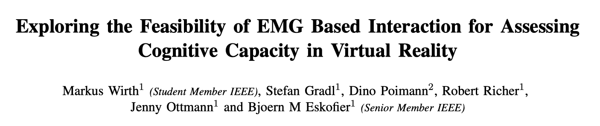
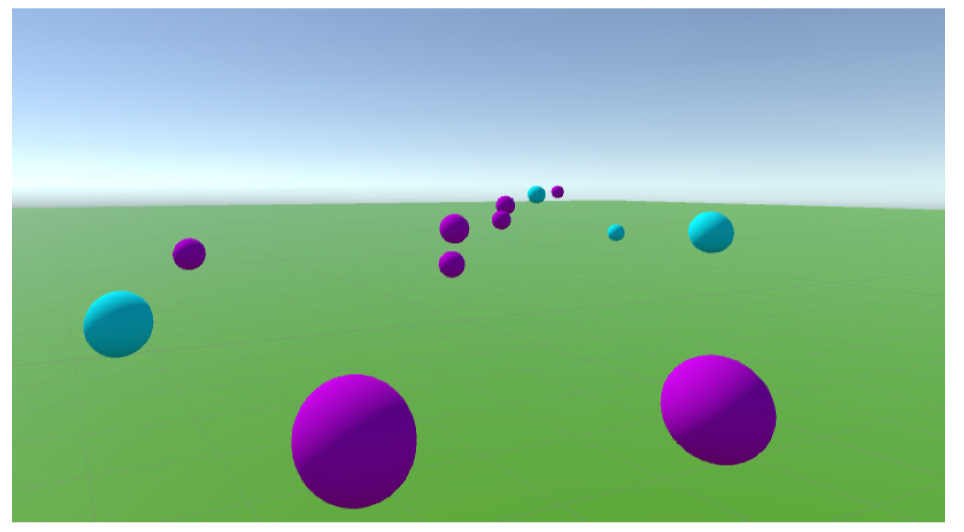
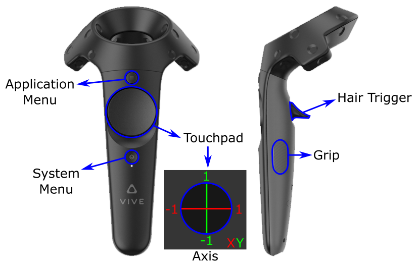
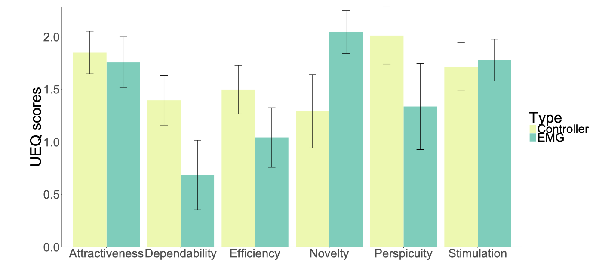
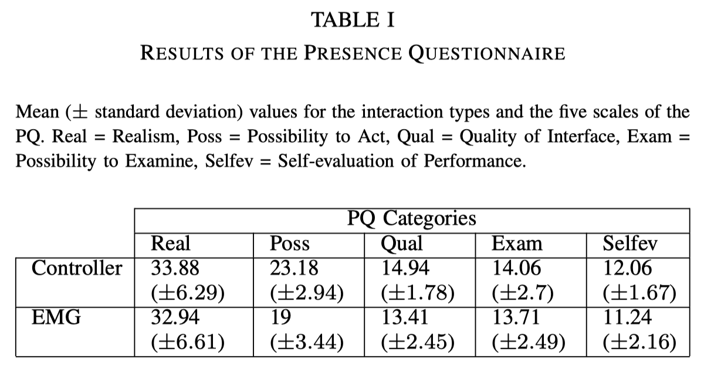

# Abstract

随着世界人口增长和老龄化加剧，痴呆、轻度认知障碍人群和残疾人数增加。要确定此类疾病的影响，寻找治疗方式，进一步提高患者日常生活治疗，需要进行认知的评估和训练。这些可以在高沉浸式的VR环境下来进行。

本文评估了基于sEMG信号的手臂肌肉运动来控制VR环境认知表现诊断和训练环境的可行性，为此与当前最先进的控制器输入在临场感和用户体验方面进行了比较。

结果表明，二者在创新性和可靠性方面存在显著差异，由于在临场感和用户体验方面有很少差异，因此sEMG可以作为一种应用要求更高的物理运动交互方式，可能对认知训练进行产生积极影响。这主要是由于实施的手势交互加强了决策和行动执行之间的联系。

# Introduction

- 研究表明人脑在16-25岁时达到巅峰性能，在此之后，认知能力（注意力、空间感知、信息处理速度）开始下降。为了减缓这种影响，需要对进行一些专门的训练。
    - Willis等人表明通过训练认知能力，个人在执行具有不同复杂性的日常任务时变得更为有效。
    - Schmiedek等人表明认知训练不仅仅针对年轻人，适用于任何年龄人群。

- 世界卫生组织预测，到2030年，年龄超过60岁的人群（14.2亿人）将会多于年龄小于10岁的人群（13.5亿人），在老龄化社会，认知障碍和疾病（例如痴呆）人群会大幅增加。
- 为了减少这些疾病的影响，提高日常生活的质量，需要开发一种新的认知诊断和康复训练工具，同时需要改进现有的工具。
- 现有的方案在以下两个方面可以改进：
    1. 结合生理和心理锻炼来加强对认知能力的训练。
    2. 使用高沉浸感和参与度的方案（当用户被一个包含他们的虚拟世界所包围并不断为他们提供刺激反馈，就会产生沉浸感，并为用户提供临场感）

- VR可以比其他媒介创造更高的沉浸感，患者在VR环境中可以减轻疼痛，避免引起恐慌或压力。
- 作者针对当前VR康复应用缺乏结合生理动作来诊断和训练认知能力，开发了一款基于前臂sEMG信号的训练系统，来验证生理动作对认知能力训练的可行性，同时在用户临场感和体验感方面与当前较先进的控制器输入方式进行对比。

# Methods

## Virtual Environment

- 开发虚拟环境的目的是评估和训练与视觉、空间意识以及执行能力相关的认知能力（例如选择时注意力、空间感知、扫描时理解力），同时还可以通过立体视觉创造一个可探索的360度深度感知空间。
- 在该系统中，用户需要区分不同激励刺激的小球（可视化为不同颜色和旋转方向的球体），如果小球的颜色是蓝色并朝向用户移动，则通过执行相应的动作来消除该小球。所有的小球都在用户周围的一个圈里产生。

- 在整个实验过程中，记录用户的所有行为表现（例如消除小球数、小球存活时间、用户错误率等），同时会显示一个分数来激励用户去正确消除小球。
- 为了更好地适应不同用户的认知能力，如果70%的小球在其生成时间的10秒内被消除，则游戏难度会进一步提升（加快小球产生的时间、增大同时存在的小球最大数），相应的，如果小球在其生命周期内被摧毁数少于50%，则游戏难度会降低。
- 虚拟环境采用HTV Vive来实现。

## Input Modalities

- 作者使用了两种不同的输入方式：
    - 第一种是Myo手环，手势为张手和握拳，通过握拳手势，并基于手环的惯性传感器来移动方向，选定目标后使用张手来消除小球。
    - 另一种是HTC Vive的控制器，通过手指推动触控板来移动方向，选定目标后按下trigger键来消除小球。

- 只有聚焦的小球才可以被消除，当选中小球时，小球会呈现高亮状态。

## User Experience and Presence

- 临场感问卷：the Presence Questionnaire（PQ）
- 体验感问卷：the User Experience Questionnaire（UEQ）

## Participants

- 18个参与者（22±4），非色盲，能使用头显，能进行轻度运动。
- 所有参与者每周至少参加一次体育锻炼。

## Experimental Design

- 每位参与者先后使用两种输入方式进行实验，每次实验持续1min，尽可能获取更好的分数。

## Procedure

- 实验开始前，获取参与者的人口统计数据和信息。
- 在参与者进行sEMG交互方式前，会向他们介绍如何穿戴myo手环和执行手势动作，确保参与者可以对每个手势动作进行切换。
- 每位参与者在实验前都有30秒的时间来了解基本的游戏规则。
- 每次实验结束，参与者被要求填写PQ和UEQ问卷，结束时，会通过录音访谈的方式来收集参与者对系统的看法。

# Results

- 评估结果分为两个部分：
    - 用户体验感和临场感
    - 录音访谈收集的看法
- 有一个参与者存在运动功能障碍，无法完成实验，最后收集到17份结果。

## User Experience

- 相比较于sEMG控制，使用手柄控制在吸引力、简明性、效率、可靠性方面分别提高了0.09，0.8，0.46，0.7。
- 在新颖感（2.05）和刺激感（1.78）方面，sEMG控制方式表现得更好。
- 使用显著性水平为0.05的配对样本t检验比较两种不同控制方式的用户体验感，在可靠性（p=0.023）和新颖性（p=0.016）两个方面存在显著性差异。

## Presence

- 使用显著性水平为0.05的配对样本t检验对比两种不同控制方式的用户体验感，发现不存在差异。
- 从下表中看出，PQ的结果在一定程度上与UEQ的结果一致。
    - 沉浸感（Real）、交互质量（Qual）、诊断可信性（Exam）、自我表现评估（Selfev）显示出微小差异。行为可能性（Poss）表现出19%的差异，说明参与者这两种方式的体验不同。

## Interview Feedback

- 大多数参与者（16个）提到，使用基于sEMG信号的交互方式更有趣且激动人心，可以更直观地消除小球。
- 所有参与者提到使用HTC Vive的控制器交互更加可靠，易于使用。
- 12名参与者提到基于sEMG信号的交互方式需要更多地考虑行动，因此感到比较大的压力。

# Conclusion

- 本文提出了一种基于sEMG信号的VR认知训练交互方式，使用Myo手环，同时与传统的HTC Vive控制器在用户临场感和体验感进行效果对比。
- 实验结果表明，基于sEMG信号的交互方式在享受乐趣方面具有优势，可以作为一种新颖的医学评估和训练工具。
- 在临场感方面，两种交互方式没有显著性差异，这意味着基于sEMG信号的交互方式不会影响用户的沉浸感，但是它可能会给用户提供更复杂的交互，因此是一项对认知要求更高的任务，建议在VR认知训练的任务中可以使用该交互方式，而不是简单的HTC Vive控制器。
- 缺陷：由于涉及的sEMG信号处理和分类的复杂性，系统可能无法准确地判断每一个动作，在某些情况下可能难以与系统交互。
