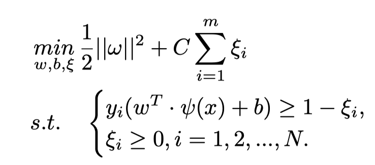

# Abstract

**多模态传感融合**可以获取更高的手势识别准确率，其难点在于从不同的模态中挖掘**判别特征和融合特征**。表面肌电信号和超声波信号是手势识别中的典型信号模式，将它们融合可以充分利用**电生理信号和肌肉形态信息**之间的**互补性**。

本文的目的是提出两种**特征融合的方法**：

- 一种是将**手动设计**的表面肌电信号和超声波特征连接起来。
- 一种是基于**卷积神经网络**的表面肌电信号和超声波信号的特征提取融合方法。

8位身体健全的志愿者参与了实验，**同步收集了对应于20个手势的4通道sEMG和A模式超声波信号**，以评估所提出的方法。

实验结果表明，**融合sEMG和超声波信号特征**的效果比单一的两个特征好，对于20个手势识别，基于**卷积神经网络**可以实现一个高的准确率（97.38±1.49%），比**手动设计特征和机器学习等算法（LDA，KNN，SVM）**都要好。

# Introduction

当前，人造假肢在提升截肢患者日常生活质量方面起到了很大的作用。在假肢手控制的应用场景中，**基于生物信号的手势识别**起到了关键的作用。对于非侵入式且便于获取的sEMG成为了手势识别中**最常使用的人机交互接口**。近些年，基于**sEMG模式识别的假肢控制**已进行了广泛的研究。

最新研究表明，通过适当的**特征提取**和**模式识别**算法，对于10种类型的手腕和手势动作，可以获得95%以上的**离线识别准确率**。然而，当待识别的手势类别更多、更复杂时，sEMG的识别准确率将**面临严峻挑战**。

>基于12通道sEMG数据50个手势40个对象的NinaPro DB2数据库，实现了KNN算法的70%准确率和SVM算法的78.71%准确率。识别率下降了很多。

深度学习算法由于可以通过神经网络自动获取有效的特征而被广泛地使用，很多研究者设法用它来提高sEMG信号识别手势的性能。

在NinaPro DB2数据集，Ding等人提出了一个**基于C-B1PB2分类模型的CNN**获取了一个更高的分类准确率78.86%。（Z. Ding, C. Yang, Z. Tian, C. Yi, Y. Fu, and F. Jiang, “semg-based gesture recognition with convolution neural networks,” Sustainability.）Hu等人设计了一种基于注意力混合的CNN-RNN网络达到了82.2%。（Y. Hu, Y. Wong, W. Wei, Y. Du, M. Kankanhalli, W. Geng, and H. He, “A novel attention-based hybrid cnn-rnn architecture for semg-based gesture recognition,” Plos One, vol. 13, no. 10, 2018.）

这些最新的研究表明，**深度神经网络**识别准确率比**手动设计特征和机器学习**高。

虽然sEMG在**假肢控制的模式识别领域**实现了很多成就，其缺陷（例如相位干扰、小空间解析）限制了它在识别精细手指运动的准确率。**超声波信号**有**高探测准确率**和**高时空解析能力**，可以用于检测表层和深层**肌肉的形态变化**，从而更好地**反映肌肉收缩并将其映射到手势**。

超声波信号可以分为**A模式超声波信号**和**B模式超声波信号**。虽然B模式可以获得更好的识别准确率，但是其所需佩戴的设备过于笨重。A模式专为便捷性而设计，是一种比较理想的**人机交互接口**。

> Yang等人对8通道A模式超声波信号数据应用LDA算法，实现了11个手指动作98.83%的平均分类准确率。（X. Yang, X. Sun, D. Zhou, Y. F. Li, and H. Liu, “Towards wearable amode ultrasound sensing for real-time finger motion recognition,” IEEE Transactions on Neural Systems & Rehabilitation Engineering, pp. 1–1, 2018.）

>Xia等人在4通道A模式超声波信号数据中应用SVM算法，对20个复杂的手势识别准确率达到了84.22%，相同的4通道sEMG数据准确率只有68.59%。（W. Xia, Y. Zhou, X. Yang, K. He, and H. Liu, “Towards portable hybrid surface electromyography/a-mode ultrasound sensing for human-machine interface,” IEEE Sensors Journal, 2019.）

为了进一步提高人机交互接口的性能，很多研究者聚焦于**多模态信号之间的融合**。

>Guo等人设计混合sEMG/NIRS传感系统，识别率大于97%，相比于单一特征（小于90%）得到了明显提升。
>
>同时开发了一种混合sEMG/mMMG系统，对于分别使用mMMG、sEMG、sEMG-mMMG准确率达到了81.6%、90.8%和95.1%
>
>W. Guo, X. Sheng, H. Liu, and X. Zhu, “Development of a multi-channel compact-size wireless hybrid semg/nirs sensor system for prosthetic manipulation,” IEEE Sensors Journal, vol. 16, no. 2, pp. 447–456, 2016.
>
>W. Guo, X. Sheng, H. Liu, and X. Zhu, “Mechanomyography assisted myoeletric sensing for upper-extremity prostheses: A hybrid approach,” IEEE Sensors Journal, vol. 17, no. 10, pp. 3100–3108, 2017.

>Bo等人表明结合sEMG和力敏电阻对21个精细的手势识别准确率达到了96.05%。
>
>W. Bo, R. Wu, K. Zhang, and L. Liu, “A new subtle hand gestures recognition algorithm based on emg and fsr,” in 2017 IEEE 21st International Conference on Computer Supported Cooperative Work in Design (CSCWD), 2017.

上述研究验证了人机界面的**识别精度受益于多模态信号的融合**。sEMG和超声波信号的融合**有助于利用电生理信号和肌肉形态信号的互补性**，最终进一步提高识别精度。

本研究的主要贡献是**提出了两种有效的sEMG-超声波信号融合方案**，并论证其**可行性**。

# Dataset Collection And Evaluation Metric

为了评估sEMG和超声波信号在手势识别上的性能，招募了**8个身体健全的志愿者参**与了实验。

参与者根据屏幕引导要求按照下图依次做出20个手势，由**4通道sEMG信号**和**A模式超声波信号**同步记录。

**4通道sEMG信号和A模式超声波信号**由一台4通道混合sEMG/AUS传感系统采集，相关细节可以在下述文献中找到。（W. Xia, Y. Zhou, X. Yang, K. He, and H. Liu, “Towards portable hybrid surface electromyography/a-mode ultrasound sensing for human-machine interface,” IEEE Sensors Journal, 2019.）

sEMG电级和超声探头共享**相同的采集位置**，采集点涉及的肌肉是**趾浅屈肌 (FDS)、尺侧腕屈肌 (FCU)、尺侧腕伸肌 (ECU) 和趾伸肌 (ED)**。

涉及的20个手势**由6个手腕动作，13个手指动作和1个休息状态动作**组成。**连续做20个动作为1组实验**，每个动作**持续5秒钟**，在两个动作之间没有休息的时间。每个实验者被要求做8组实验，各组实验之间休息25秒。因此，每个对象一共有1000秒的sEMG信号和超声波信号被采集。（$20*5*8+8*25=1000$）

原始**sEMG数据采样率为1000Hz**，**超声波数据获取为10帧每秒**（一系列在滑动窗口的sEMG数据作为一个样本，一帧超声波信号作为一个样本）。为了使**用于分类的sEMG样本数与超声样本数一致**，采用窗口大小为256ms、步长为100ms的滑动窗口对sEMG样本进行划分。此外，**第一秒和最后一秒的数据被丢弃**，因为**动作处于转换中**。 每次试验之间的 25 秒数据也被丢弃。 这样，**sEMG 样本和超声样本的数量均为4800**。

本文中，使用**4折交叉检验**来评估模型的预测性能，每个对象的数据**分为4组**（3组为训练集，1组为测试集）。**测试集中的识别准确率**被定义为正确分类的样本数与总体测试样本数之间的比值，通过交叉验证的**平均识别准确率**作为每个对象的分类度量。最后分类模型的评估度量为**所有对象的平均识别准确率**。

# Method

本文提出了**sEMG和超声波处理和识别分类**的两条路线。

- 一种是基于长期领域经验，手动设计sEMG和超声波特征，应用LDA，KNN和SVM等机器学习算法。
- 另一种是利用卷积神经网络 (CNN) 自动提取 sEMG 和超声特征，并将提取的特征映射到手势上。

## 手动设计特征方法

手动设计特征方法使用的机器学习算法如下图所示，分别经历**预处理、特征提取、特征正则化、主成分分析和分类**。由于需要将sEMG和超声波信号进行融合，PCA后需要将sEMG和超声波的特征进行拼接，并通过PCA进行再次降维。

### 信号处理与特征提取

原始sEMG信号**以50Hz的倍频进行梳状滤波**，分别**以20Hz和500Hz的上下限截止频率进行带通滤波**，在滑动窗口中的sEMG信号统计结果值作为sEMG特征。

本文选用**TD-AR6**作为sEMG信号特征，由于它被广泛使用（L. Hargrove, K. Englehart, and B. Hudgins, “The effect of electrode displacements on pattern recognition based myoelectric control,” in Conference International Conference of the IEEE Engineering in Medicine & Biology Society, 2006.）。

>TD-AR6包括4个时域特征和自回归模型的6阶AR系数
>
>- 平均绝对值：Mean Absolute Value，MAV
>- 波形长度：Waveform Length，WL
>- 过零数：Zero Crossing Number，ZC
>- 斜坡标志变化：Slop Sign Changes，SSC
>- 6阶AR系数：AR6

4个通道的TD-AR6特征最终堆叠在一起，形成**维度为40的sEMG特征**。$(4+6)*4=40$

原始的超声波信号通过**预处理（时域增强补偿、带通滤波、包络检波、log压缩）来移除噪声并提取有用的信息**。每个通道的**前后20个点**数据将被丢弃，由于他们无法提供有效的信息并且可能有消极影响。

对于每个通道，剩下的960个点分成48个段，提取**MSD特征（每个段的平均值和标准差）**，最后四个通道的MSD特征都会被计算和堆叠。因此，**超声波信号的特征维度为384**。$48*2*4=384$

本文使用**PCA算法**来降低特征维度，首先**分别对sEMG特征和超声波特征进行降维**，之后**对结合后的sEMG-超声波信号特征进行降维**。

### 机器学习分类

在提取和优化特征后，**选择一个合适的分类器是下一个关键的步骤**，通常在该领域使用的离散手势识别有LDA、KNN和SVM。

- **LDA分类器**基于高斯假设和贝叶斯决策，是目前基于生理信号的离散手势识别最广泛使用的分类器之一，LDA算法没有超参数。

- **KNN算法**常用于分类问题，对于测试点，根据选择的距离公式，从训练集中过滤最近的K个点，将测试点归类为这K个点中比例最大的类。本文采用的距离度量为欧拉距离。$dist(\hat{X},X)=\sqrt{\sum^n_{i=1}(\hat{X}_i-X_i)^2/n)}$，其中$n$表示特征的维度，其中$K$为超参数。

- **SVM算法**寻找分类的最大间隔，**核函数**使得其可作为非线性分类器。SVM模型的判别式可以定义为：$g(x)=w^T\cdot \psi(x)+b$，其中$w^T$为权重矩阵，$\psi(\cdot)$为核函数，$b$表示偏差。

    - SVM算法的任务是找到最优的$(w^T,b)$
    - 为了计算异常点对模型训练的影响，使用**松弛变量**$\xi$，最优目标可以写为：

    

    - 其中$N$表示训练样本的数量，惩罚因子$C$避免$\xi_i$过大，本文选择的核函数为RBF核（径向基函数）。

### 超参数调优策略

比较sEMG、超声波、sEMG-超声波的性能主要依赖于**分类准确率**。为了使比较更加公平，应在**PCA和分类器**中进行超参数的优化。

当分类器选择为KNN或SVM时，需要联合优化KNN分类器和SVM分类器的主成分数和超参数，可以将其看作是一个**多层优化问题**。

在超参数调优过程中，同时进行PCA和分类器超参数调优的搜索空间太大，时间成本无法忍受。特别的，LDA算法没有超参数，因此它可以对主成分数进行调优。

本文的调优政策是**首先选择LDA作为分类器，确定最优的主成分数**，之后的调优过程中**固定该数值**，并调整其他KNN和SVM分类器的超参数。

## CNN提取特征方法

采用CNN模型可以自动提取信号特征并将它们投影到手势分类中，下图所示的网络模型（EU-Net模型）适合于sEMG和超声波信号。

为了满足神经网络的输入要求，分别用4x256和4x960的大小来处理sEMG和超声波信号，并且正则化为$[-1,1]$。

网络由**3个卷积层**、**2个最大池化层**、**2个全连接层**、**2个Dropout层**和**1个Softmax层**组成。

EU-Net网络模型有两个分支，分别提取sEMG和超声波特征，通过卷积层提取特征后，将sEMG和超声波的特征图展平为特征向量并连接在一起。

# Experimental Results

## 手动设计特征方法

### 超参数调优

下图展示了**sEMG信号或超声波信号分类准确率**与**主成分数**之间的关系。

实验结果表明，为了获取**最好的分类准确率**，sEMG特征保持初始维度（40），超声波特征维度240。

在降维后结合sEMG和超声波信号特征形成**融合sEMG-超声波信号特征**，之后执行PCA算法，下图展示了实验结果，最优的主成分数为270。

当确定各特征主成分数后，在之后将会一直固定，之后**仅调整分类器的超参数**。

分类器中，**LDA没有超参数，KNN主要调节K值，SVM主要调整惩罚因子C**。

下图展示了KNN参数调优分别对**sEMG、超声波信号、sEMG-超声波信号**的实验结果，结果表明，对sEMG来说K值最优为35，超声波信号最优为35，sEMG-超声波信号最优为29。

下图展示了SVM参数调优分别对**sEMG、超声波信号、sEMG-超声波信号**的实验结果，结果表明，对sEMG来惩罚因子最优为400，超声波信号最优为5，sEMG-超声波信号最优为9。

### 分类准确率

当确定最优主成分数和超参数后，分别用3个分类器来评估3个数据集的分类准确率，如下图所示：

从结果中看出，不管使用何种分类器，**sEMG-超声波信号的特征都是分类最好的**，接着是单独超声波信号，最差是sEMG信号。对于分类器，**SVM识别准确率最好，其次是LDA，最差是KNN**。

## CNN提取特征方法

下图展示了使用CNN网络来进行分类的结果：

对所有实验者的平均识别准确率：**sEMG信号为81.06±4.72%，超声波信号为96.53±2.25%，sEMG-超声波信号为97.38±1.49%**

所有实验者的平均识别率如下表所示：

从表中可以看出：

- **不管是机器学习算法还是深度学习算法，超声波信号的识别准确率都大于sEMG信号**。这是因为超声波信号**更加灵敏，并且有更好的空间分辨率**，对于离线手势识别有更好的性能。（该结论也符合之前文献结论）
- **不管是手动设计特征还是CNN提取特征方法，sEMG-超声波信号的识别准确率结果都比单独sEMG和超声波信号强**，这表明sEMG和超声波信号特征之间存在互补信息，将两个特征融合可以充分利用电生理信息和肌肉形态信息的互补性。
- **对于特征提取方法**，不管是sEMG、超声波信号还是sEMG-超声波信号，CNN算法自动提取特征都比机器学习算法效果好，这表明CNN可以**挖掘更多有效特征并且有更好的表示能力**。

# Conclusion

- 通过比较，超声波信号在分类准确率上优于sEMG信号，尤其是在复杂的手势识别任务中。
- 本文提出了两种特征融合的方法，不管哪种方法，sEMG-超声波信号特征总是由于单独的信号特征，这表明sEMG和超声波信号特征之间存在互补信息，并且将两个特征融合存在一定的可行性。
- CNN自动特征提取比传统人工特征提取方法好，此外，sEMG和超声波信号可以共享同一个基于CNN的特征提取器，这为手势识别中多模态信息特征融合提供了启示。

