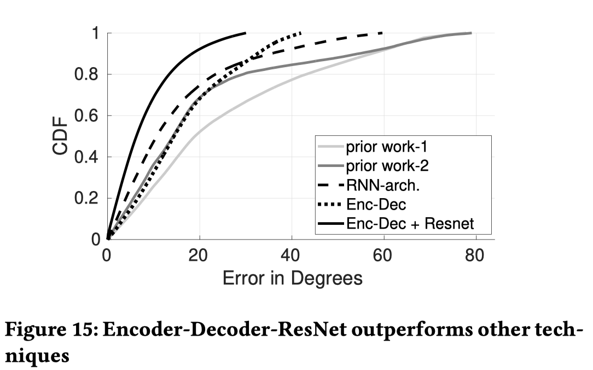

**the Web Conference 2021，CCF A**

# Abstract

普遍存在的手指动作跟踪能够在增强现实中实现很多新颖的应用：运动分析、康复治疗和触觉反馈等等。

本文呈现了NeuroPose，基于Myo手环实现了3D手指动作跟踪，肌电图可以感知手指活动引起的肌肉电信号，从而为精细的手指运动提供丰富的信息。然而多个手指的信号在传感器上会叠加成复杂的信号，从而使得将传感器信息转化为3D手指动作很难。

为了解决这个问题，NeuroPose将手指运动的解剖学信息与循环神经网络、编码解码网络和深度残差网络的机器学习模型结合在一起，从EMG数据中提取3D手指运动。

此外，还利用迁移学习算法以最小的训练开销将一个用户上的预训练模型调整为一个新用户身上。

对12位用户的实验表明，在追踪3D手指关节角度时，误差为6.24度。

对于Myo手环放置位置与用户手腕位置的变化，该系统都可以保持较为稳定的精度。

NeuroPose在手机上进行运算，处理延迟为0.101s，能量开销较低。

# Introduction

- 3D手指姿势追踪在运动分析、康复治疗、手语识别、增强现实、虚拟现实、触觉等领域有大量的应用。
    - 对用户手指运动的分析可以提供一些自动化的指导支持。
    - 手指运动的稳定性可以预测潜在的神经元疾病。
    - AR/VR游戏以及机器人假肢设备的精确控制是3D手指姿势跟踪的其他常用应用。

- 由于上述广泛的应用，基于单目摄像头的计算机视觉实现了3D手指姿势追踪（无需深度摄像头），然而基于视觉的方法在捕获复杂的手指运动时需要解决遮挡、较亮的光源等问题。
- 相比较于视觉方法，穿戴设备的主要优点是无需外部基础设备，可以实现随时随地跟踪，同时也可以避免遮挡和光源强度等问题。
    - 当前数据手套已经广泛应用与手指动作的跟踪，然而实验证明其笨重的外壳可能会影响手指的灵活运动。
    - 作为一种替代品，将传感器放在手腕上（肌电手环）正被探索研究，但是这种方式只能识别数十种的手势。
    - 与离散手势识别不同，红外与热源相机可以识别连续的3D手势跟踪，但其对手部运动有一些限制。

- 针对以上问题，本文作者基于Myo手环开发了一款系统，有如下优点：
    - 直接从肌肉中捕获激活手指运动的信息，从而可以预测连续的3D手指运动。
    - 用户无需将传感器佩戴在手指上，因此可以做一些较为精细的手指运动。
    - 追踪过程可以在独立的环境下进行，对环境光或呈现对象的地理位置没有要求。
    - sEMG传感器可以测量情绪（例如害怕）和肌肉疲劳感来使得进行安全的VR任务（例如消防建筑等）和体育活动（如攀岩）更加真实。

- 尽管上面这些优点，然而sEMG传感器无法像智能手机或者智能手表那样受欢迎，因此用户需要随身携带一个单独的sEMG手环。由于sEMG手环可以捕获精细的手指运动，近几年在AR/VR领域有大量的研究。作者相信之后会更好的被社会所采纳。
- 一些挑战：
    - 手指的关节高度灵活，各个关节的自由度可达21度。
    - 多个手指的sEMG信号混杂在非线性模型中，难以从传感器数据中解耦单个手指的信号。
    - 捕获到的信号强度取决于动作的速度和手指的姿势
    - 不同体型、生理的用户捕获到的sEMG数据不同。
    - 由于硬件之间干扰，传感器的数据存在噪声。

- 为了解决上述问题，NeuroPose做了一些工作：
    - 手指的运动模式不是完全随机的，其遵守一定的解剖学约束，将这些约束条件与实际的传感器数据进行融合，可以大大减少搜索空间。
    - 引入机器学习算法，显式或隐式融合上述的约束与传感器数据，采用RNN、Encoder-Decoder、ResNets等模型来实现高精度。
    - 采用基于自适应批处理归一化的迁移学习，以最小的开销学习用户依赖的特征，使得预训练模型适用于新用户进行3D姿势跟踪。

- NeuroPose在手机上实现，运行延迟在0.1s内，低功耗。
- 针对12名用户实现了6.24度的中位数误差，以及90%用户的18.33度误差，对于传感器的位置以及用户手腕位置的变化，该系统的鲁棒性变得都很不错。

# Background

## Hand Skeletal Model

- 人手可以用4根手指和1根拇指组成一些高自由度的表达。
- 图（a）中描述了手部的骨骼结构，各关节负责生成3D手部姿势来进行表达。
- 图（b）为简化的运动学视角，4根手指组成掌指（MCP）、近端指间（PIP）和远端指间（DIP）关节。
- 图（c）展示了向手掌弯曲或伸展手指，PIP和DIP关节角只有单自由度。
    - 除了屈曲外，MCP关节可以进行内收和外展，因此其有两个自由度，分别用$\theta_{mcp,f/e}$和$\theta_{mcp,aa}$表示。
    - 因此，每根手指具有四个自由度。
    - 拇指与手指的解剖学结构方面有一些细微的差别，指节间（IP）关节可以单自由度$\theta_{ip}$弯曲和伸展，MCP与腕掌（TM）关节拥有弯曲、外展内收的自由度，因此拇指有5个自由度$\theta_{ip}$，$\theta_{mcp,f/e}$，$\theta_{mcp,aa}$，$\theta_{tm,f/e}$，$\theta_{tm,aa}$

- 另外六个自由度来自手掌的移动，包括平移或者旋转，本文专注于手指的运动而忽视手掌的移动，因此总共有21个自由度（4*4+5=21），模型是21维空间$\mathbb{R}^{21}$，即NeuroPose的目标是从$\mathbb{R}^{21}$空间中跟踪3D手指姿势。

- 负责手指表达的各关节角之间具有高度的相似性与依赖性，以下是一些关节约束：
    $$
    \theta_{dip}=\frac{2}{3}\theta_{pip}
    $$

    $$
    \theta_{ip}=\frac{1}{2}\theta_{mcp,f/e}
    $$

    $$
    \theta_{mcp,f/e}=k\theta_{pip},\quad 0\le k\le \frac{1}{2}
    $$

    - 公式（1）说明为了弯曲DIP关节，PIP关节也必须进行一些弯曲（假设手指没有受到外力作用）

    - 相似的，公式（2）是对拇指的一个约束，公式（3）说明PIP运动范围受到MCP关节的限制。

    - 手指的一般运动约束范围如下：
        $$
        -15^{o}\le \theta{_{mcp,aa}}\le 15^{o} \\
        0^{o}\le \theta{_{dip}}\le 90^{o} \\
        0^{o}\le \theta{_{pip}}\le 110^{o}
        $$

        - 显然，外展/内收相比较于伸展/收缩的运动范围更小。

    - 除了上述约束，手指运动之间还存在其他复杂的依赖关系，很难用简单的方程形式来约束。但是机器学习可以自动地从数据中学习这些约束，并利用它们进行高精度追踪。

## Electromyography Sensor Model

- sEMG手环可以检测骨骼肌经过神经激活生成的电信号，这些信号可以提供运动单元的时序活跃信息，这些信息不仅可以检测和预测肌肉活动时带动的身体运动也可以诊断多种神经系统疾病，从而理解身体状况、老龄化和神经系统的疲劳感。
- 肌肉激活：
    - 图（a）和（b）展示了人类手臂的解剖学结构：
        - 拇长伸肌（Extensor Pollicis Longus）伸展拇指关节。
        - 拇长短展肌（Abductor Pollicis Longus and Brevis）进行拇指外展。
        - 拇固有伸肌（Extensor Indicis Proprius）伸展食指。
        - 指伸肌（Extensor Digitorum）延伸4根手指。
        - 小指伸肌（Extensor Digiti Minimi）延伸小指。
        - 骨间掌侧肌群（Volar interossei group）和骨间背侧肌群（Dorsal interossei group）分别负责食指、无名指和小指向内/远离中指的内收和外展。
        - 它们连接到近节指骨和指伸肌。
    - NeuroPose主要关注与肌肉执行手指的动作，其他涉及大规模动作和支持力量的肌肉包括前臂运动的旋后肌（Supinator），肘关节的桡肘肌（Anconeus）和肱桡肌（Brachioradiali），腕关节的尺侧腕伸肌（Extensor Carpi Ulnaris）、桡长腕伸肌（Extensor Carpi Radialis Longus）和短腕伸肌（Brevis）等

- 追踪肌肉激活的可行性：
    - 目标肌肉中，有些肌肉接近皮肤表面，有些在皮肤深层（如指伸肌Extensor Indicis）
    - 一个问题：仅仅使用sEMG信号就可以捕获所有激活的肌肉吗？
    - 为了验证这个猜想，作者进行了一个简单的实验，弯曲和伸展5根手指，同时观察sEMG通道的激活情况。从下图可以看出，所有手指在弯曲和伸展的肌电通道上都表现出明显的信号活动。
    - 为了进一步观察，在图（f）中提供了一个所有手指都弯曲和伸展的信号图。
    - 从图中可以得出，每根手指都单独产生一个明显的弯曲和伸展的运动模式。
    - 重要现象：负责食指运动的肌群（指伸肌）是非表面肌群，但也会在肌电图中产生一个明显的尖峰。（图（b））
    - 这些信号可以进一步进行仔细地分析，以捕获手指关节角度的精确大小，特别是当多个手指同时运动时，从肌电图中分类出单个手指动作。

- 生物模型：

    - 肌肉由基本的肌纤维（muscle fibres，MF）组成，主要负责收缩。

    - 大脑激活肌纤维会导致一种被称为动作电位（action potential，AP）的电势沿着肌纤维传递，称为运动纤维激活电位（motor fibre activation potential，MFAP）。

    - 这些肌纤维不是单独地被激活，而是以称为运动单元群一起被激活。

    - 一组运动单元一起协同收缩一块肌肉，单个MFAP无法检测，运动单元中所有MFAP一起产生一个信号，称为运动单元动作电位（motor unit action potential，MUAP），如下式：
        $$
        MUAP_{j}(t)=\sum^{N_{j}}_{i=1}MFAP_i(t-\tau_i)s_i
        $$

        - 其中，$\tau_i$是时序偏移量，$N_j$是运动单元$j$中肌纤维数目，$s_i$表示肌纤维是否激活的0-1变量。
        - 时序偏移量取决于肌纤维的位置。
        - 在MUAP中获取到MFAP的数量也取决于肌电手环电极的位置，因为由远端肌纤维产生的电位通常在电极上以衰减的形式被检测到。
        - 相同的肌肉动作可能导致产生不同形状的MUAP信号，这取决于肌肉的先前状态以及变化的时序偏移量$\tau_i$。

    - 公式（5）表述了一个运动单元的激活实例，但是运动单元必须反复激活以保持肌肉激活的状态，肌肉连续激活可以产生一系列间隔放电的MUAP脉冲，如下式：
        $$
        MUAPT_j(t)=\sum^{M_j}_{k=1}MUAP_{jk}(t-\delta_{jk})
        $$

        - 其中$M_j$是第$j$个运动单元激活的次数，$\delta_{jk}$是第$j$个运动单元的第$k$次激活时间。

    - 最终，肌电手环电极检测到的电势是由分隔开的运动单元在它们时序激活下的信号叠加，如下式：
        $$
        EMG(t)=\sum^{N_m}_{k=1}MUAPT_j(t)+n(t)
        $$

        - 其中$n(t)$为噪声项，$N_m$为激活运动单元数目。

    - 理论上，sEMG是由每一根肌纤维的激活组成的，但实际上电极只能检测到离电极较近范围内肌纤维发出的电信号，因为随着距离的增加，信噪比会降低。当sEMG被捕获后，之后的难点在于将信号分解为负责单个关节动作的激活（需要使用机器学习模型）。

# Platform Description

- Myo手环由8个肌电通道构成，包含加速度计、陀螺仪和磁力计的惯性传感单元（IMU），数据通过无线蓝牙传给PC或智能手机等设备。
- NeuroPose基于sony xperia z3手机捕获EMG信号，并提供手指动作追踪的结果。
- sEMG信号数据属于比较敏感的数据，同时为了最大限度减少平台的干扰，NeuroPose只选择了2个通道的数据，在可容忍的准确度范围内提供一个低干扰预测。

- 皮肤温度校准：
    - sEMG的幅度值会轻微地受到皮肤温度差异的影响，因此在进行实验前需要进行预热操作，这有助于Myo手环与肌肉之间形成更强的电极连接，最大限度地减少温度的影响。
- 其他平台：
    - 当前还没有类似于智能手机或智能手表这种大众都接受认可的sEMG传感器平台，Meta最近申请了一些Myo手环的专利，用于开发手指跟踪技术，以推动AR/VR应用的发展。
    - 学术界和工业界提出了其他获取sEMG的方案，例如臂带、纹身贴和臂套等，但对于那种方案最好目前没有达成共识。（本文提出的机器学习模型也不能直接应用于其他硬件设备）。

# Core Technical Modules

本文对多种机器学习模型追踪3D手指动作进行了讨论

## Encoder Decoder Architecture

- 为了生成具有合理空间约束的手指动作序列，同时满足随时间平滑变化，作者设计了encoder-decoder网络。
    - 该网络捕获一段时间内整体时序传感数据而不是单个时刻的样本，这使得网络能够执行和学习关键的时空约束，考虑历史sEMG数据以辅助手部姿势的推断，网络接收5s的传感器数据，输出相应的3D手部姿势序列。

- Encoder：

    - 与简单的离散手势识别不同，该模型的输出空间是一个$\mathbb{R}^{21}$的连续域。
    - 在这21维数据中，5个维度（4根手指的$\theta_{dip}$和拇指的$\theta_{ip}$）可以直接通过公式（1）和（2）计算，因此，网络的实际输出只有16维——$\mathbb{R}^{16}$。
    - 一种实现方式是使用一系列卷积层来建立一个网络，但这样会增加网络参数的数量，不仅会造成计算复杂度和内存问题，同时在收敛性方面也存在一定的问题。因此，Encoder使用一系列下采样卷积滤波器，可以对输入压缩表示，之后用于decoder生成3D手势。
    - 输入Encoder的x是一个$T\times 8$维的多通道sEMG信号，本文选择$T=1000$，是200Hz采样率历时5s。
    - Encoder由一系列的CONV-BN-RELU-MAXPOOL层组成，具体如下：
        - CONV子层包括一些执行基本卷积操作的2D卷积过滤器，提取sEMG信号的时空特征来学习表示手指动作的特征。
        - BN（batch normalization）子层通过控制从一层传递到下一层的输入分布的巨大差异来加快模型的收敛。
        - ReLU（Rectified Linear Unit）激活层激活BN层的输出，非线性特征是训练深度神经网络的关键，ReLU函数具有强大的生物学激活，便于实现，方差规模小，更好的梯度传播。同时在ReLU激活后加入了Dropout层，作为一种自适应的正则化形式，以0.05的随机概率去掉网络的一些参数。
        - MAXPOOL层将输出特征下采样以达到sEMG数据的紧凑特征表示，通过对初始表示的非重叠子区域应用一个max过滤器来实现。例如用$2\times 2$的最大过滤器对一个输入大小为$100\times 100$数据进行过滤，会得到一个$50\times 50$的最大元素输出结果。
    - 第一个CONV-BN-RELU-MAXPOOL层应用32个2D$3\times 2$的卷积过滤器，在时间和空间域上，将特征分别降低5和2。其他层的过滤器大小和数目可以参见图6，第二和第三层的时间和空间上的下采样为$(4\times 2)$和$(2\times 2)$，因此最后输出的encode表示维度为$25\times 1\times 256$，decoder处理该数据以获取手指关节角。

- Residual Blocks：

    - 一个显然的问题：为什么不增加网络的深度来加强特征表示？主要的原因是更深的网络更难去优化，同时在参数收敛方面存在困难。

    - ResNets提出一个革命性的想法，在层之间引入跳过连接，以便在更强的特征表示和收敛之间取得平衡。

    - 跳过连接，也被称为残差连接，提供了一个层间的快捷连接，假设$y$和$x$分别代表网络中不同层的中间表示，y比x更深，两者之间有一些其他层，则跳过连接可以由如下式表示：
        $$
        y=f(x,W_l)+x
        $$

        - 其中$f(x,W_l)$表示x和y的中间层，由于y与x之间存在一个快捷路径，因此x的表示可以直接加上$f(x,W_l)$。最开始，网络可以选择忽略$f(x,W_l)$，直接令y=x，随着网络的训练，可以利用快捷路径之间更深的层$f(x,W_l)$来学习比基本模型更强的特征。

    - 作者在Encoder和Decoder之间加入ResNets，可以提高模型的精确度。

- Decoder：

    - Decoder将encoder的表示映射到3D手部姿势。
    - Decoder使用上卷积层来进行上采样同时增加encoder表示的大小来匹配输出的形状。
    - Dncoder由一系列的CONV-BN-RELU-UPSAMPLE层组成，具体如下：
        - CONV层将Encoder的表示映射到关节角。
        - BN层和RELU激活层与Encoder中工作类似。
        - UPSAMPLE层用于增加特征表示的采样率，多层上采样（采用最近邻插值）逐渐增加紧凑Encoder特征的大小，以匹配输出大小。
    - Decoder在时域和空域中分别按$(5\times 4),(4\times 2),(2\times 2)$因子进行上采样，与最后一层$1000\times 16$的输出形状相匹配。

- 最终，应用均方误差损失函数来进行微调：

    - 下式中$\hat{\theta}$表示机器学习模型的预测值，$\theta$表示深度相机的训练标签。

        - 计算均方误差来预测4根手指的MCP和PIP关节

        $$
        loss_{mcp,f/e}=\sum^{4}_{i=1}(\hat{\theta}_{i,mcp,f/e}-{\theta}_{i,mcp,f/e})^2
        $$

        $$
        loss_{pip}=\sum^{4}_{i=1}(\hat{\theta}_{i,pip}-{\theta}_{i,pip})^2
        $$

        $$
        loss_{mcp,aa}=\sum^{4}_{i=1}(\hat{\theta}_{i,mcp,aa}-{\theta}_{i,mcp,aa})^2
        $$

        - 计算均方误差来预测拇指的MCP和TM关节

        $$
        loss_{thumb}=(\hat{\theta}_{th,mcp,aa}-{\theta}_{th,mcp,aa})^2+\\(\hat{\theta}_{th,mcp,f/e}-{\theta}_{th,mcp,f/e})^2+\\(\hat{\theta}_{th,tm,aa}-{\theta}_{th,tm,aa})^2+\\(\hat{\theta}_{th,tm,f/e}-{\theta}_{th,tm,f/e})^2
        $$

        - 预测关节角中加强匀速光滑约束，其中$\theta_{t}$是时间步长$t$时所有关节角的向量：

        $$
        loss_{smoothness}=\|(\bigtriangledown\hat{\theta}_t-\bigtriangledown\hat{\theta}_{t-1})\|^2_2
        $$

        - 整体损失函数可以如下式表示：

        $$
        loss=loss_{mcp,f/e}+loss_{mcp,aa}+loss_{pip}+loss_{thumb}+loss_{smoothness}
        $$

        - 注意损失函数不包括$\theta_{dip}$和$\theta_{ip}$，因为这两个值可以直接由公式（1）和（2）计算得出。

- 手指运动范围约束：

    - 每根手指有明确的运动约束范围：
        $$
        -15^{o}\le \theta{_{mcp,aa}}\le 15^{o} \\
        0^{o}\le \theta{_{dip}}\le 90^{o} \\
        0^{o}\le \theta{_{pip}}\le 110^{o}	\tag{4}
        $$

    - 为了应用这些约束，将关节倾角的预测输出除以其约束范围实现归一化（例如$\theta_{dip}$除以$90^o$）

    - 之后应用一个Bound ReLU激活函数作为网络的最后激活层，BReLU增加最终输出的上界约束，将BReLU的输出再次乘以他们的约束范围，这样输出的单位就是度了。BReLU结合其他基于时间约束的损失函数（公式13）有助于预测解剖学上的可行性以及时间上的平滑追踪结果。

    $$
    bReLU(x)=
    \left\{
    \begin{array}{**lr**}  
                 0, & x<0 \\  
                 x, & 0\le x \le n\\  
                 n, & x \ge n
                 \end{array} 
    \right.
    $$

## Transfer Learning with Semi Supervised Domain Adaptation

- 如果对每个用户使用上述encoder-decoder模型进行训练是具有负担的，因此，需要采用域适应策略，预训练一个源用户模型，之后对其进行微调以低开销的方式训练新的用户。
- 基于域适应的迁移学习在计算机视觉和语音处理很受欢迎，例如：
    - 在ImageNet上预训练的AlexNet模型通过微调可以分类医学领域、遥感、乳腺癌的分类。
    - 一个预训练的BERT语言模型通过微调可以进行文本总结、问题答复等任务。
    - 通过迁移学习可以大大减少训练一个新任务的负担。
    - 类似地，可以使用来自一个用户的预训练模型，针对不同用户对其进行微调，可以在显著减少训练开销的情况下而不损失很多准确性。
- 在BN层应用域适应，由于BN在用相对较少的参数减少协变量移位以加快收敛方面取得了足够的成功，因此将其用于域适应。
- 本文域适应处理过程如下：
    1. 使用一个用户的带标签数据生成该用户的广泛训练模型——即预训练模型。
    2. 从新用户那边采集小的训练数据，之后并没有从头开始为目标用户开发模型，而是将模型权值初始化为与预训练的模型相同。
    3. 冻结除BN层外的所有层参数，使用来自新用户的少量标签来更新BN层，以最小化损失函数。
    4. 由此生成的模型将用于对目标用户进行推断。
- BN层将学会充分地将新用户的分布转换为模型预训练的源用户的分布，之后源用户的预训练模型就可以使用这里讨论的微调步骤对新用户执行推断，可以将新用户的训练开销减少一个数量级。

## RNN Architecture

- encoder-decoder模型获取了5s的传感器数据，因此可以利用复杂的时空关系。
- 为了确保模型的实时性能，需要不断地处理任何给定时刻的前5s数据，这会由于大量的计算而消耗更高的能量，因此采用RNN模型来较少计算。
- RNN模型如下图所示：
    - 生成的sEMG信号数据不仅依赖于肌肉收缩时维持当前手指姿势，还依赖于肌肉中施加力量来讲手指移动到一个新的位置，这种时间依赖关系可以用一个RNN网络建模。
    - 每个RNN单元接收输入一个八通道sEMG数据样本与之前的隐藏状态，使用长短期记忆网络由于它可以处理消失/扩大的梯度，同时选择性地忘记/记住过去的特征。
    - 模型输出16维的手指关节和一个新的隐藏状态作为下一个RNN单元迭代的输入。

- 训练过程中，输出采用与encoder-decoder架构相同的均方根误差函数和时间约束，在训练中使用截断的时间反向传播，截断64个时间单元。

# Performance Evaluation

- 设计实验来全面测试NeuroPose对传感器位置的鲁棒性、可用性和对用户的关节角度的准确性。
- 比较各个机器学习模型，整体训练花费，以及在智能手机上执行效率的系统级测量。

## User Study

- 12参与者（8男4女），20-30岁，体重47-96kg

### Data Collection Methodology

- 参与者左手佩戴Myo手环，4通道朝上，实验开始前，在实验者的指导下，移动所有手指尽可能遍及整个动作范围，这样可以确保机器学习模型的良好收敛性以及对任意手指运动的泛化性，手势没有单独的类别，运动模式完全是任意的，从而使得数据更容易采集。
- 之后按照指令执行随机手指动作，包括手指的弯曲或伸展以及外展或内收，从而将所有可能的手部姿势纳入。

### Labels for Training and Testing

- 采集的数据：
    - 8个sEMG信号（Myo手环）：3维手势追踪
    - 手指3D坐标、关节角（Leap Motion）：验证的基础，训练NeuroPose模型提供标签（每根手指的关节角）
- Myo手环与Leap Motion同步数据使用协调时间时（UTC）。

### Training Data Collection

- 每位参与者进行12个环节（每个环节3min，环节间有足够的休息时间）
- 前6个环节，传感器与手腕的位置不变（维持在下图的Normal状态），后6个环节，卸下并重新戴上传感器（分别执行Up、Down、Bend、Down、Up、Mobile，在Mobile情况下，手腕可以在Leap Motion的检测范围内上下移动、旋转）。

### Test Data

- 使用后六组实验数据进行测试：
    - Myo手环卸下后又重新戴上
    - 手腕佩戴位置与之前训练模型完全不同

## Implementation

- 桌面端与手机端
- TensorFlow
- 训练：i7-8700K，16GB 内存，GTX1080
- Adam优化器，学习率1e-3，$\beta_1=0.9$，$\beta_2=0.999$，每个CONV层后加入0.01的L2正则，RELU激活层后加入0.05的Dropout
- 训练模型生成后，在手机上使用TensorFlowLite。

## Performance Results

### Qualitative Results

- 下图展示了NeuroPose的定性结果，（a）-（c）是静态结果，（d）-（g）是动态结果，（h）是错误结果
- 对错误案例研究表明，NeuroPose都遵守实际手部姿势运动，可能会存在一些延迟，而这个延迟导致了错误结果。
- 另一个结论是金标准（Leap Motion）检测拇指的运动范围有限制。

### Accuracy over Users

- 图（a）显示所有关节角的偏差度数：
    - 多用户模型：均值9.38，方差很大。
    - 域适应模型：卷纸6.24，方差也很大，但比多用户模型小一些。

### Robustness to Natural Variations in Sensor Position and Orientation

- 评估方式（准确率比较稳定）：
    - 摘下并重新佩戴（6次）
    - 不同的时间、气温、湿度（4天）
- 鲁棒性基于三个原因：
    - 松紧舒适的佩戴，位置与方向只有毫米级改变，通道4有明确的标记，用户在多次佩戴时保持同一方向
    - 从肘部延伸到手腕的肌肉结构图表明，目标肌肉和传感器的相对位置变化很小
    - Myo传感器预热以确保肌肉与电极的良好接触

### Robustness to Wrist Position and Mobility

- 图（c）显示了改变手腕位置后测量的错误大小，NeuroPose可以准确地跟踪手指动作即使手腕发生了移动
- 手指运动而激活的肌肉与手腕的状态无关

### Accuracy over Fingers

- 对于每根手指，通过$\theta_{mcp,f/e},\theta_{pip},\theta_{dip}$来计算角度。
- 对于拇指，通过$\theta_{mcp,f/e},\theta_{tm,f/e},\theta_{ip}$来计算角度。
- 结果表明，NeuroPose可在误差接受范围内跟踪所有的手指。

### Accuracy over Flex/Extension Joint Angles

- 图（a）展示3个弯曲角$\theta_{mcp,f/e},\theta_{pip},\theta_{dip}$，NeuroPose对所有角的准确度都近似
- 图（b）展示 外展/内收 比 屈曲/伸展 的误差小，这是因为外展/内收动作角的范围很有限

### Intrusiveness and Accuracy Trade-offs:

- 图（c）展示使用Myo手环不同数目通道的误差，最佳结果是使用8个通道，然而4通道甚至2通道可以在准确率与功耗方面达到一个trade off。

### Training Overhead

- 图（a）展示了训练数据的准确率，总体而言域适应比用户依赖的模型好一些。

### User Dependent Training

- 图（b）展示了不同用户的误差关系。

### Accuracy Breakup by Techniques, Comparison to Prior Work

- 下图展示了与之前的工作相比，本文的误差关系。
- 最好的是Encoder-Decoder+ResNet模型

### Latency Profiling

- Encoder-Decoder+ResNet模型以5秒的sEMG信号作为输入，使用TensorFlowLite处理5秒数据需要0.101秒，可以确保模型的实时性。
- 图（a）展示了时延比较

### Power Consumption Analysis

- 图（b）展示了能耗比较

# Discussion and future work

- 无监督域适应：
    - NeuroPose只需要90秒的训练样本用预训练模型来定制一个新用户的模型
    - 未来可能探索一种无监督域适应来定制一个不需要任何训练标签的预训练模型（对抗域适应Adversarial domain adaptation）

- 提供截肢者帮助：
    - 本文招募的实验对象都是身体健全的人，作者未来考虑针对截止患者进行实验。（镜像双边疗法）

- 手握物体的追踪：
    - 手握一个物体时，握力可能会对手指运动的肌肉信号产生干扰。
    - 在增强现实和假肢装置有很多情况下会让用户手握物体，作者之后会改进NeuroPose的算法，以最大限度地减少用户手握物体时额外肌肉信号的干扰。

# Conclusion

- 本文展示了使用sEMG手环对3D手部姿势跟踪的可行性，很多增强现实应用、运动分析、医疗康复和假肢可以在跟踪手指关节获取不错的收益。
- sEMG手环获取的数据含有噪声，不同的手指信号之间会有叠加，本文利用解剖学约束和运动模式中时间的平滑性，将传感器的数据分解成组成手指运动模式。将上述约束条件整合到encoder-decoder机器学习模型中，以实现在不同关节角度，不同手势类型等方面的高精度。
- 在一个低功耗的手机平台上实时运行实现。

