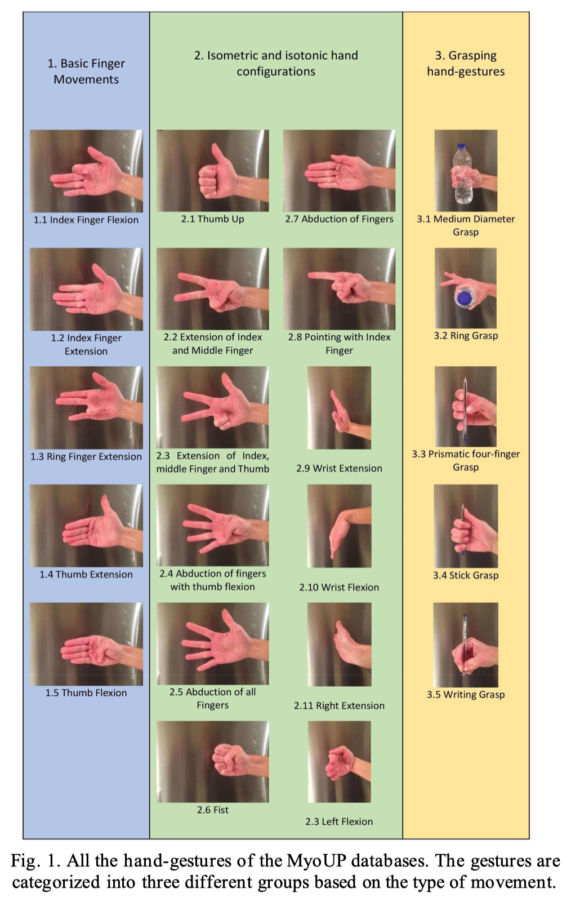

# Abstract

过去几年，**通过深度学习方法基于表面肌电信号进行手部姿势识别**引起了极大的研究兴趣。本文的工作是**构建一种新颖的卷积神经网络框架**用于手部姿势识别。本文模型在避免过度拟合的同时，与更浅的网络相比，并没有表现出明显更好的结果。结果表明，**一些手势之间的sEMG记录缺乏多样性限制了模型的性能**。此外，我们基于商业设备 (Myo Armband) 生成的数据库的分类准确度比使用相同设备记录的同类数据集**高24%左右**。

# Introduction

人机交互领域，人们在过去的几十年里，对创建**利用手势识别的用户界面**产生了极大的兴趣。科研社区广泛采纳了**基于表面肌电的手势识别分类**，尤其是在人造假肢的应用上。然而诸如**假肢控制缺乏鲁棒性**、**无专业人员帮助的情况下难以调整sEMG传感器**以及**应用机器学习算法的数据量有限**等挑战，导致**假肢运动不自然**。

在过去的几年里，开展了广泛的研究来解决**基于sEMG的假肢算法效率问题**。1993年，基于神经网络进行表面肌电手势识别（对于4种手势，可以达到91.2%的准确率）。如今采用深度学习算法，**卷积神经网络**在实现高准确率的表面肌电分类中扮演了一个重要的角色。

在文献（K. Park, and S. Lee. “Movement intension decoding based on deep learning for multiuser myoelectric interfaces,” In Proceedings of the 4th International Winter Conference on Brain-Computer Interface (BCI), 1–2, 2016.）中，第一次提出端到端的深度学习模型，对于6种手势识别，**CNN的准确率超过了SVM**。

在文献（M. Atzori, M. Cognolato, and H. Müller. “Deep Learning with Convolutional Neural Networks applied to electromyography data: A resource for the classification of movements for prosthetic hands,” Frontiers in Neurorobotics, 10, 2016.）中，作者采用了LeNet模型，用于**分类53种手势**。即使是这样简单的模型，结果也比传统的方法效果好。

在文献（W. Geng, Y. Du, W. Jin, W. Wei, Y. Hu, and J. Li. “Gesture recognition by instantaneous surface EMG images,” Scientific Reports, 6(36571), 2016.）和文献（W. Wei, Y. Wong, Y. Du, Y. Hu, M. Kankanhalli, and W. Geng. “A multi-stream Convolutional Neural Network for sEMG-based gesture recognition in muscle-computer interface,” Pattern Recognition Letters, 2017.）中表明，**使用dropout和批标准化**（batch normalization）可以提高sEMG-CNN分类器的准确率。

虽然基于CNN的分类效果好，但是其**需要大量的sEMG数据集来保证高准确率**，这会花费**大量的时间**以及需要请**大量的志愿者**。目前有一些开源的数据集（capgMyo和Ninapro等），然而这些数据集都是在**特定的sEMG设备**上采集的，需要专业人员来进行校准。

本文的目标是进一步延续sEMG的手势识别，提出一种新的CNN模型，并且使用Myo制作一个新的sEMG数据集，

# The MyoUP Database

为了获取sEMG数据，尤其是来自不需要专业校准的设备，本文受Ninapro数据集启发，使用Myo手环设备（采样率200Hz和8个干电极，相对来说便宜且易穿戴），生成了一个较大的**sEMG数据集MyoUP**，如下图所示：

MyoUP数据集由**8个研究对象**采集（3女5男，1左手7右手，年龄22.38±1.06岁），志愿者在执行每组采集任务之前都已经熟悉了整个流程。

采集手势分为三种类型：

- 5种基本手指运动
- 12种张收手部运动
- 5种抓握优势

志愿者要求**重复每个手势5次，持续5秒，中间休息5秒**以避免肌肉疲劳，要求做出手势时，在显示屏上会出现相应手势的照片。

测试助理**将Myo手环戴在志愿者的惯用手上**，在志愿者较为舒适的位置，并且设备将准确检测sEMG信号。

# Data Analysis And Network Architecture

