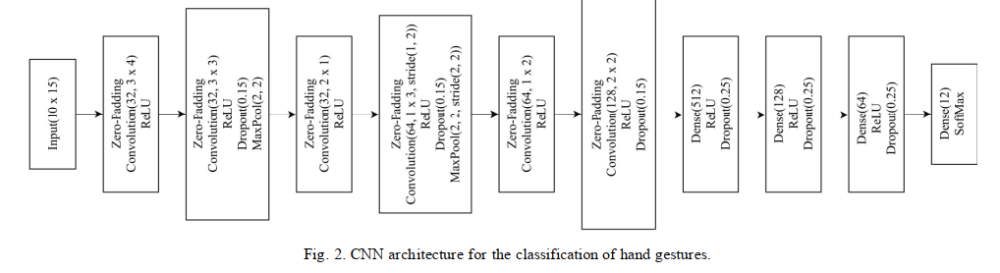
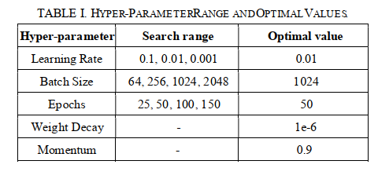
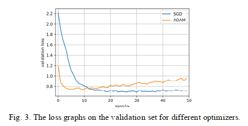
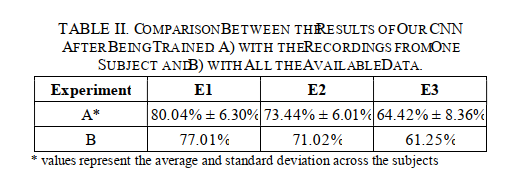
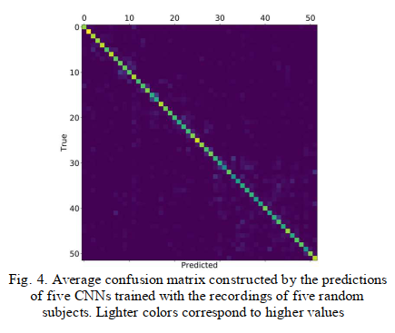
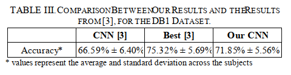
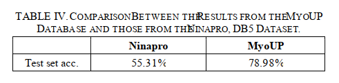
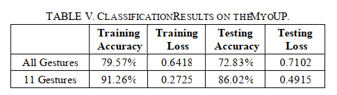

# Abstract

过去几年，**通过深度学习方法基于表面肌电信号进行手部姿势识别**引起了极大的研究兴趣。本文的工作是**构建一种新颖的卷积神经网络框架**用于手部姿势识别。本文模型在避免过度拟合的同时，与更浅的网络相比，并没有表现出明显更好的结果。结果表明，**一些手势之间的sEMG记录缺乏多样性限制了模型的性能**。此外，我们基于商业设备 (Myo Armband) 生成的数据库的分类准确度比使用相同设备记录的同类数据集**高24%左右**。

# Introduction

人机交互领域，人们在过去的几十年里，对创建**利用手势识别的用户界面**产生了极大的兴趣。科研社区广泛采纳了**基于表面肌电的手势识别分类**，尤其是在人造假肢的应用上。然而诸如**假肢控制缺乏鲁棒性**、**无专业人员帮助的情况下难以调整sEMG传感器**以及**应用机器学习算法的数据量有限**等挑战，导致**假肢运动不自然**。

在过去的几年里，开展了广泛的研究来解决**基于sEMG的假肢算法效率问题**。1993年，基于神经网络进行表面肌电手势识别（对于4种手势，可以达到91.2%的准确率）。如今采用深度学习算法，**卷积神经网络**在实现高准确率的表面肌电分类中扮演了一个重要的角色。

在文献（K. Park, and S. Lee. “Movement intension decoding based on deep learning for multiuser myoelectric interfaces,” In Proceedings of the 4th International Winter Conference on Brain-Computer Interface (BCI), 1–2, 2016.）中，第一次提出端到端的深度学习模型，对于6种手势识别，**CNN的准确率超过了SVM**。

在文献（M. Atzori, M. Cognolato, and H. Müller. “Deep Learning with Convolutional Neural Networks applied to electromyography data: A resource for the classification of movements for prosthetic hands,” Frontiers in Neurorobotics, 10, 2016.）中，作者采用了LeNet模型，用于**分类53种手势**。即使是这样简单的模型，结果也比传统的方法效果好。

在文献（W. Geng, Y. Du, W. Jin, W. Wei, Y. Hu, and J. Li. “Gesture recognition by instantaneous surface EMG images,” Scientific Reports, 6(36571), 2016.）和文献（W. Wei, Y. Wong, Y. Du, Y. Hu, M. Kankanhalli, and W. Geng. “A multi-stream Convolutional Neural Network for sEMG-based gesture recognition in muscle-computer interface,” Pattern Recognition Letters, 2017.）中表明，**使用dropout和批标准化**（batch normalization）可以提高sEMG-CNN分类器的准确率。

虽然基于CNN的分类效果好，但是其**需要大量的sEMG数据集来保证高准确率**，这会花费**大量的时间**以及需要请**大量的志愿者**。目前有一些开源的数据集（capgMyo和Ninapro等），然而这些数据集都是在**特定的sEMG设备**上采集的，需要专业人员来进行校准。

本文的目标是进一步延续sEMG的手势识别，提出一种新的CNN模型，并且使用Myo制作一个新的sEMG数据集，

# The MyoUP Database

为了获取sEMG数据，尤其是来自不需要专业校准的设备，本文受Ninapro数据集启发，使用Myo手环设备（采样率200Hz和8个干电极，相对来说便宜且易穿戴），生成了一个较大的**sEMG数据集MyoUP**，如下图所示：

MyoUP数据集由**8个研究对象**采集（3女5男，1左手7右手，年龄22.38±1.06岁），志愿者在执行每组采集任务之前都已经熟悉了整个流程。

采集手势分为三种类型：

- 5种基本手指运动
- 12种张收手部运动
- 5种抓握优势

志愿者要求**重复每个手势5次，持续5秒，中间休息5秒**以避免肌肉疲劳，要求做出手势时，在显示屏上会出现相应手势的照片。

测试助理**将Myo手环戴在志愿者的惯用手上**，在志愿者较为舒适的位置，并且设备将准确检测sEMG信号。

# Data Analysis And Network Architecture

## Data Analysis

用于分类任务的数据集：

- **Ninapro-DB1**：由10 Otto Bock MyoBock 13E200 electrodes记录
- **Ninapro-DB5**：由Myo手环记录
- **MyoUP**：由Myo手环记录

DB1的记录数据由10通道sEMG信号组成，采样率为100Hz。

由文献（M. Atzori, M. Cognolato, and H. Müller. “Deep Learning with Convolutional Neural Networks applied to electromyography data: A resource for the classification of movements for prosthetic hands,” Frontiers in Neurorobotics, 10, 2016  ）中方法，信号进行1Hz的低通过滤，并且用长度为150ms以及60%交叠的滑动窗口构建**CNN输入图像（分辨率10x15）**。同样的处理方式用于**Myo数据（分辨率8x15，8个通道**）。

为了避免过拟合同时增加模型的准确率，应用**数据增强技术**来增加图片的数目。具体来说，第一次采用**原始图片**训练，第二次采用**高斯白噪声（SNR值为30dB）模糊后的图片**进行训练。

最后将图片划分为**训练、验证和测试集**。

## CNN模型

CNN模型由**6个卷积块**（32【3x4】，32【3x3】，32【2x1】，64【1x3】，64【1x2】，128【2x2】）构成，所有的卷积操作后紧跟**ReLU激活函数**，第2个和第4个卷积块中加入**最大池化操作**（2x2），第2个、第4个和第6个卷积块中加入**dropout层（丢失率0.15）**。

**3个全连接层**（512，128，64）紧跟其后，同时伴随**ReLU激活函数**和**dropout层（丢失率0.25）**。

最后是**含有softmax激活函数的全连接层（K为手势种类个数）**。

模型权重使用**Xavier初始化**。（X.Glorot and Y.Bengio. “Understanding the difficulty of training deep feedforward neural networks,” In Proceedings of the 13th International Conference on Artificial Intelligence and Statistics (AISTATS), Sardinia, 249-256, 2010  ）

>如果没有全连接层，则分类效果会显著性降低。另一方面，如果增加网络深度则会导致过拟合。
>
>经过作者测试，丢失率为0.25得到的dropout结果是最好的。

网络的**超参数**选择是通过**5重交叉验证**和**手动调参**来进行的，验证集由DB1中**随机选择的四个志愿者数据组成**。

作者测试了**48种不同的超参数组合**，最后选择了最优值。

优化器选择的是**stochastic gradient descent（SGD）**而不是**Adam**，因为后者会在一些epochs执行后导致**过拟合**。

通过这种方式，作者稳定了**验证集的loss**，并使验证准确率**提高了大约 3%**。

# Results And Discussion

作者为了评估模型，分别在**基准数据集（Ninapro DB1和Ninapro DB5）**和**自己生成的数据集（MyoUP）**进行了验证。

对于**Ninapro DB1**，作者评估了网络在**3个有代表性的手势组上的性能**，同时还将**分类准确度**与**较浅的CNN的准确度**进行比较。

然后，使用**Ninapro DB5**和**MyoUP**进行实验，测量使用**低成本商业设备Myo**记录 sEMG 数据时的网络行为。

## Ninapro DB1

首先，作者使用模型对DB1的数据集进行测试，针对每个志愿者的3组不同的手势组（E1、E2和E3）：

- 第一组包括12个基本的手指移动。
- 第二组包括8个收张手部运动和9个基本的手腕运动。
- 第三组包括23个抓握运动。

评估结果基于测试集上的平均准确率，从结果中看出，模型**更容易识别出第一组包含简单手指移动的动作（80.04%）**，**较难识别出复杂的抓握动作（64.42%）**。

- A：对每一个人的单独数据进行训练
- B：对所有人的数据进行训练

从这个例子中看出，在深度学习中，**准确率不一定随着数据量的增加而增加**。

（文献：P. Tsinganos, B. Cornelis, J. Cornelis, B. Jansen, and A. Skodras. “Deep Learning in EMG-based Gesture Recognition,” In Proceedings of the 5th International Conference on Physiological Computing Systems (PhyCS), Seville, 107-114, 2018.  有解释：对于相似的手势，例如**拇指的内收和屈曲**会导致误判。）

下图展示了为随机对象计算的**手势分类混淆矩阵**，作者将这个过程**重复了五次**，以便系统地了解**哪些运动组合会导致错误分类**。

最后，作者与文献（M. Atzori, M. Cognolato, and H. Müller. “Deep Learning with Convolutional Neural Networks applied to electromyography data: A resource for the classification of movements for prosthetic hands,” Frontiers in Neurorobotics, 10, 2016.  ）的方法进行了对比，得出结果：

作者的CNN更深、更复杂并且使用更多数据进行训练，因此在准确度上超过了文献中的CNN， 另一方面，作者的模型性能不如文献中结果最高的算法（**随机森林**）。

## Ninapro DB5 And MyoUP

作者测试他们的模型**在DB5数据集中对12个手势进行分类的准确度**，与它对**MyoUP数据集**中完全相同的手势进行分类的准确度相比。

从表中可以看出，作者的模型在MyoUP数据集上训练得到更好的准确率。

之后，在所有MyoUP的手势中进行实验，发现**准确率在73%左右**。选择了11个最容易识别的手势，**准确率增加到86%**。

# Conclusions

- 本文提出一种**新颖的CNN模型**，基于sEMG信号来识别手部姿势。该CNN模型相比于之前文献中的结果，**提升了5.5%的准确率**。
- 本文贡献了**sEMG数据集MyoUP**，由Myo手环采集。使用同样的网络对比基准数据集Ninapro DB5（55.31%），**MyoUP展现了更高的准确率**（78.98%）。
- 由上述结果中看出，作者提出的**网络和数据集**在手部姿势识别任务中是可靠的。之后会进一步确定是否将某些相似的手部姿势进行分类后，可以得出更高的准确率。

