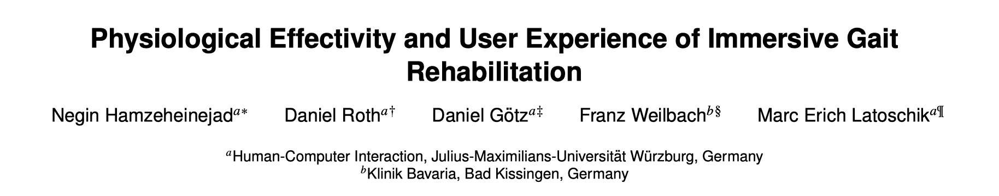

# Abstract

由神经受损导致的步态运动障碍需要进行反复尽力的体育锻炼来达到康复的目的。由于各种原因，在临床环境中长时间的体育锻炼很容易让人失去耐心和动力，严重降低治疗效率。

本文介绍了一个用于步态康复的沉浸式VR系统，意于提升用户的体验和激励，同时唤醒类似于真实体育锻炼的效果。系统提供了一个由广阔田野、森林、大山、瀑布、动物、海滩组成的虚拟环境，用于鼓舞人心的漫步，并且在散步的时候能够与一个虚拟教练为伴。

在进行临床实验之前，对健康受试者评估了该系统的有效性，与非VR条件相比，在连续三天内对45名健康参与者进行了持续跟踪研究，结果表明该系统能够引起体育锻炼类似的生理反应，同时引起了更高的兴趣与动力。

虽然用于测试时随着时间的推移训练效果略有下降，但仍旧高于非VR条件下的结果，虚拟教练对训练的效果没有产生显著的影响。

总体而言，本文的结果给用户体育锻炼提供了可替代的方案，同时为未来的工作奠定了研究方向。

# Introduction

- 由脑卒中或脊柱损伤造成的神经组织受损会影响日常的行走。
    - 例如脑卒中患者会遭受感觉、运动、认知和视觉障碍这些影响日常生活的能力。
- 大多数脑卒中患者会经历运动障碍（肌肉协调性和力量受限或丧失，腿部运动缺陷影响平衡和行走能力），因此步态康复对脑卒中康复是一个关键的方面。
- 有效的康复需要重复且尽力的训练来诱导神经可塑性，但是传统的康复训练由于缺乏激励措施无法达到很好的康复效果。
- 辅助康复机器人提供高强度的驱动训练，可以增加训练环节的效果（如下图所示），相关产品近几年一直在稳定增长。

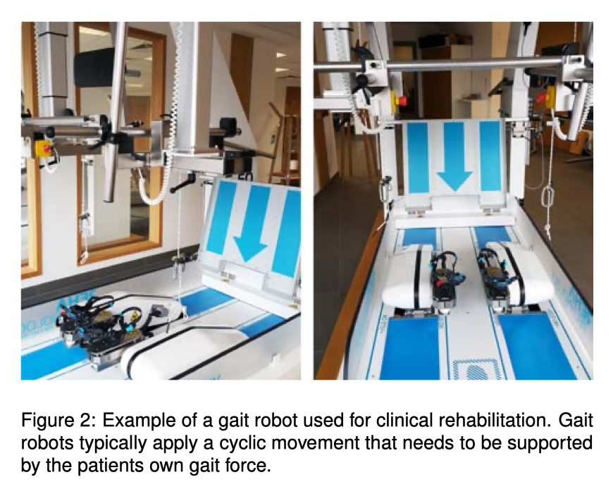

- VR场景被证明能够增加动力并减少患者对疲劳的感知，同时提供多通道的感官刺激，对神经组织修复有利，可以适度地提高步态和平衡康复，尤其是与传统的康复方法相结合。
- 本文为治疗神经受损导致的步态障碍，设计、开发和评估了一款基于VR的沉浸式康复训练系统，系统提供了一个由广阔田野、森林、大山、瀑布、动物、海滩组成的虚拟环境，用于鼓舞人心的漫步，并且在散步的时候能够与一个虚拟教练为伴。
    - 作者进行了为期3天的持续性跟踪，研究VR媒介对训练者内在动机与用户感知体验的影响。

# Methods

- 作者开发了一个由四个不同自然风格组成的虚拟环境（草地、森林、溪流地和海滩）。用户使用HMD来进入沉浸式体验，同时需要进行脑卒中动作模仿练习。

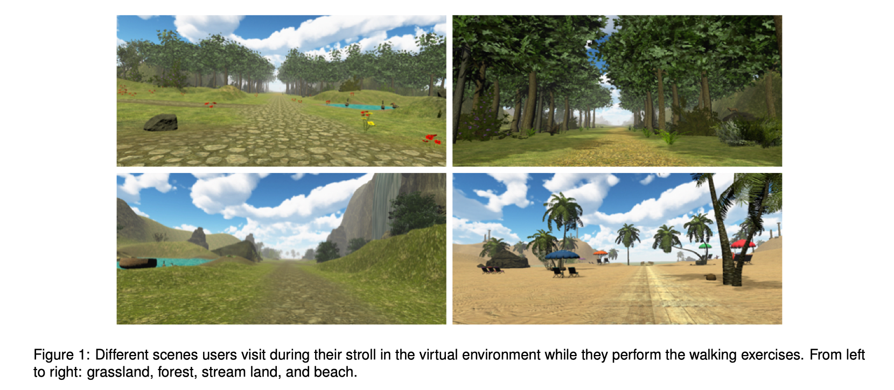

## Virtual Trainer

- 作者认为场景中加入虚拟教练有如下作用：
    - 虚拟教练可以提供额外的训练动力。
    - 如果个人观察教练的运动并模仿其步行动作，可以更好地激发镜像神经元的激活。
- 因此作者设计了一个与用户相似的女性虚拟教练，走在用户的前面。
- 实验开始前，虚拟教练会指导用户行走1000步，用于获取用户的步速能力。在行走的过程中每当经过100，250，500，750，1000步的时候虚拟教练会发出一些鼓励词（Nice job，awesome）。同时当用户移动的步速不正确时，虚拟教练也会进行提醒。这些提醒的声音都来自真实的人声。

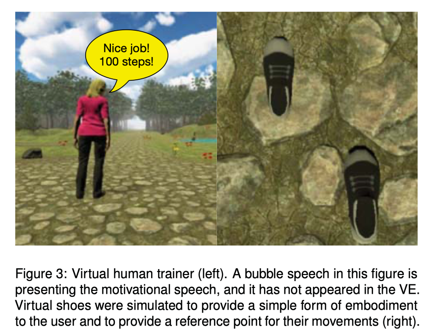

## Apparatus（设备）

- 开发环境：Windows10，Unity 2017.4.0f1
- 虚拟教练：Mixamo 3D animation software
- 电脑配置：Intel Core i7-6700k 4.0 GHz CPU, 32 GB of RAM, NVIDIA GeForce GTX 1070 Graphics card
- 跑步机：the Cardiostrong Cross trainer (EX90 PLUS)
- 头显：HTC Vive
- 两个无线追踪器连接到跑步机的踏板上，用于测量步态数据（步数、行走距离、均速、每步时长、最大速度、每分钟最大步数），两个控制器之间的直行方向距离用于计算步长，每一步的步长与时间用于计算速度和每分钟步数。
- 在VR环境中，参与者使用头显的耳机，听到节拍器和环境的声音。
- 在非VR环境中，参与者仅听到节拍器的声音。

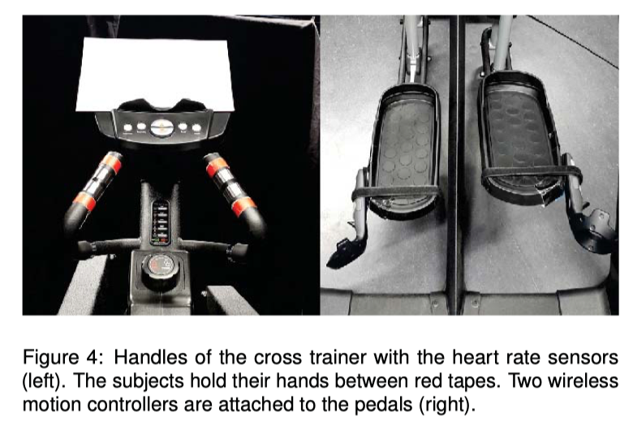

# Evaluation

## Design

跟踪训练一共有2x2x3个变量（VR有无、教练有无、持续三天），参与者随机指定一种训练模式，之后重复该模式进行三天训练。

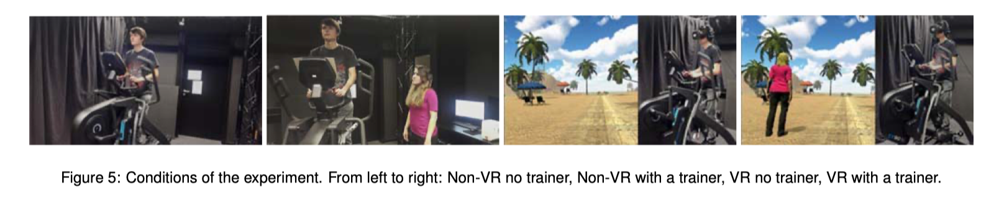

## Task

参与者以均速0.27m/s、平均每分钟39.69步数行走1000步，参与者根据节拍器（每分钟40次）来调整步行的速度。在第一天，参与者需要模仿30s脑卒中患者行走，之后他们还有30s来适应环境。

## Measure

### Control Measures

作者使用全局激励量表（Global Motivation Scale，GMS）来评估用户的动机感，该表从1（低）到7（高）表示不同的激励程度。

同时作者根据参与者之前进行运动的频率、体重指数、VR设备的体验程度，进一步评估定量的模拟数据（均速、停顿和步频）。

### Subjective Measure

- Simulator Sickness Questionnaire（SSQ）量表用于测量实验前后用户的不适感
- The NASA Task Load Index（NASA-TLX）用于评估用户步行活动后的感知工作量
- Intrinsic Motivation Inventory （IMI）用于评估用户的步行活动的内在动机
- Positive and Negative Affect Schedule (PANAS) 量表用于评估用户训练效果
- The User Experience Questionnaire（UEQ）量表用于评估用户的参与感

### Physiology

作者在0，25，500和1000步的时候使用心率传感器评估参与者的心率情况。

## Procedure

每位参与者进行持续三天的研究，每天他们都要花费75分钟的时间来完成任务。

在实验的第一天，工作人员会要求参与者去阅读实验指示和导向，同时让使用VR环境的用户去学习如何使用HTC头显。

实验的每一天，参与者在实验开始前阅读并签署同意书，在第一天回答人口统计表和GMS问卷，工作人员指示参与者在跑步机上定位，让他们的手放在手柄上，脚放在踏板上。

每种环境下，参与者都被要求在跑步机上行走25分钟（或1000步），参与者将他们的步行速度与他们在训练期间听到的节拍器的节拍相一致（每分钟40次），实验结束后填写其他问卷。

VR环境下，参与者佩戴HTC头显，三天内演示4个不同的训练场景，每个场景之间的过度都是无缝的（即草地、森林、溪流地和海滩），暴露的时间为3、5、15、2分钟，参与者持续在沉浸环境中25分钟，每个场景之间没有中断。参与者每天要走遍所有的景观，中途可以提出要休息（但实验过程中没有人要求休息）。真实和虚拟的教练使用相同的激励语句和说明。

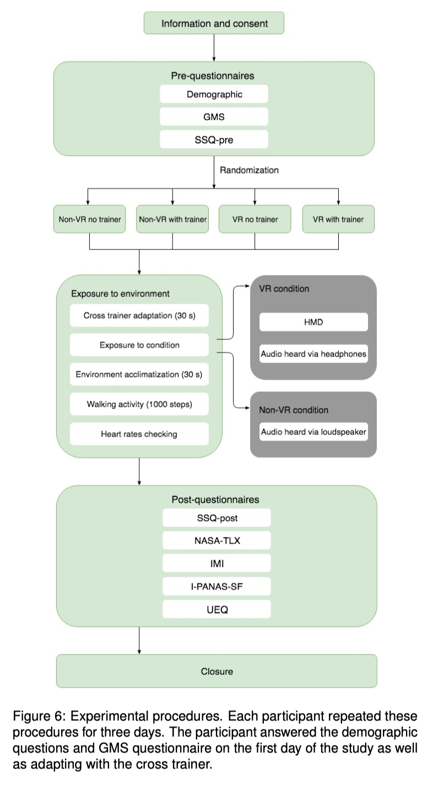

## Participants

- 招募了45个学生参与者（23男22女）参与为期三天的实验。
- 年龄（M=21.82，SD=1.84）
- 下表展示了各个参与者的分组情况

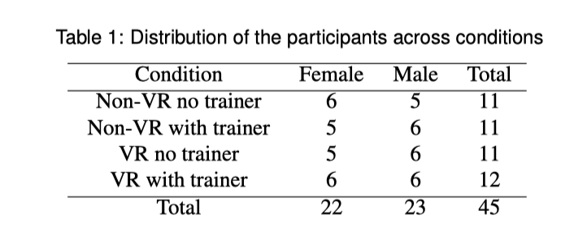

- 所有参与者的矫正视力正常，他们之前每周平均进行运动时间（M=3.26，SD=2.21），BMI（M=22.13，SD=2.45），之前M=8.03小时的VR体验，VR分组下的所有参与者都提出之前至少有一次VR体验。

# Results

运用独立的三变量方差分析了解VR、教练和训练时间的影响，由于数据是参与者使用数字问卷输入的，作者排除了数据输入和测量错误导致的异常值，

## Simulator Sickness

作者采用Kennedy使用的SSQ实验方法，计算实验前后总分的差值。

>R. S. Kennedy, N. E. Lane, K. S. Berbaum, and M. G. Lilienthal. Simulator sickness questionnaire: An enhanced method for quantifying simulator sickness. The international journal of aviation psychology, 3(3):203–220, 1993.

结果表明，VR环境（M=6.32，SE=2.65）相比较于非VR环境（M=1.76，SE=2.71）分数差异更高，不适感在第三天（M=5.86，SE=1.59）达到最高，第二天（M=3.37，SE=1.68），第一天（M=2.89，SE=3.26）

## Task Load

为了分析结果，作者评估每次测量的TLX分数。

### Mental Demand

结果表明第一天（M=14.68，SE=2.27）比第二天（M=8.43，SE=1.20），第三天（M=7.35，SE=0.97）都要高，第二天与第三天之间的差异不大。

## Physical Demand

结果表明第一天（M=25.00，SE=2.81）比第二天（M=21.34，SE=2.08），第三天（M=19.70，SE=2.05）都要高，VR环境（M=26.0，SE=2.91）比非VR环境（M=16.70，SE=2.97）要高。

## Temporal Demand and Performance

作者发现时间与表现之间存在一些显著性差异，第一天效果最差。

## Intrinsic Motivation

### Enjoyment

第一天最高（M=3.52，SE=0.18），第二天（M=3.36，SE=0.18），第三天（M=3.15，SE=0.20）

VR环境（M=3.63，SE=0.25）比非VR环境（M=3.06，SE=0.25）高。

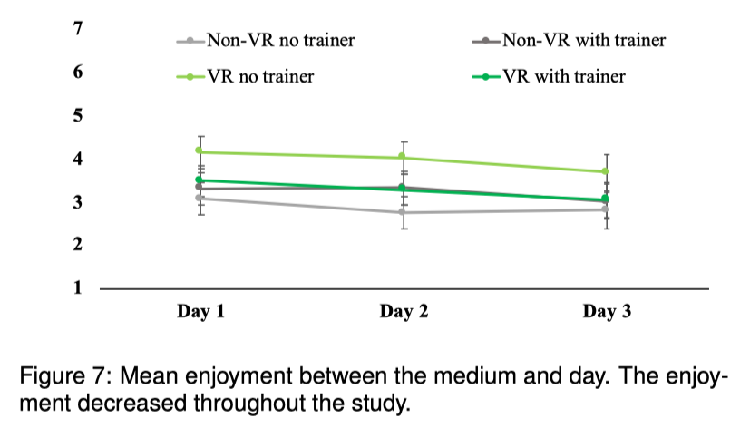

### Competence and Effort

Competence（能力方面） ：第二天（M=5.42，SE=0.13）最高，第一天（M=4.94，SE=0.14），第三天（M=5.36，SE=0.14）

Effort（努力程度）：第一天（M=4.82，SE=0.14）最高，第二天（M=4.77，SE=0.14），第三天（M=4.35，SE=0.15）

### Pressure

VR场景（M=2.33，SE=0.14）比非VR场景（M=1.78，SE=0.14）要高。

第一天（M=2.22，SE=0.13）最高，第三天（M=1.91，SE=0.93）最低。

### Value

VR条件在没有虚拟教练（M=4.25，SE=0.32）时评分较高，在有虚拟教练（M=3.53，SE=0.31）时评分较低。

非VR条件下，有体能教练（M=4.53，SE=0.32）时评分较高，没有体能教练（M=3.25，SE=0.32）时评分较低。

从上述结果中得出，体能教练增加了锻炼效果，虚拟教练降低了感知的价值。

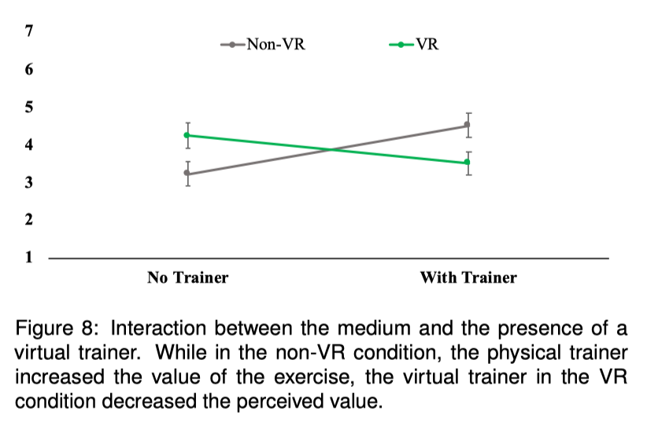

## Affect

第一天（M=3.14，SE=0.114）最好，第二天（M=2.86，SE=0.089），第三天（M=2.71，SE=0.110）

## Heart Rate

为了测量运动的生理反应，分别在25，500，1000步的时候测量与起始的差异。

从结果中看出，从25步到500步的时候心率增加，从500步都1000步的时候心率降低。

VR环境下，有虚拟教练时心率会降低。非VR环境下，有体能教练时心率会上升。

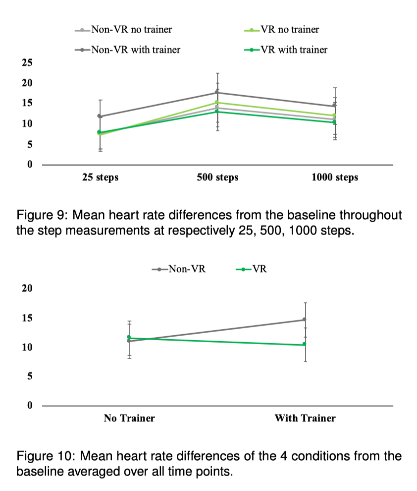

## User Experience

### Perspicuity（简明性）

第一天（M=6.17，SE=0.11），第二天（M=6.37，SE=0.77），第三天（M=6.36，SE=0.89）

简明性第二天有所增加，第三天趋于稳定。

VR环境（M=6.13，SE=0.11）比非VR环境（M=6.47，SE=0.112）要高。

### Novelty（新颖性）

VR环境（M=5.06，SE=0.21）显著比非VR环境（M=2.52，SE=0.22）要高。

第一天（M = 5.31，SE = 0.224），第二天（M = 4.97，SE = 0.24），第三天（M = 4.89，SE = 0.23）

新颖性第一天最高，第二天降低，第三天趋于稳定

### Stimulation（刺激性）

VR环境（M = 4.35，SE = 0.32）比非VR环境（M = 3.13，SE = 0.32）要高

刺激性在所有组别中，随着天数有所降低。

### Efficiency（效率性）

非VR环境有教练（M=5.02，SE=0.17）比VR环境有教练（M=4.25，SE=0.16）要高

两者没有教练的情况下结果没有显著差异。

### Dependability（可靠性）

第一天最低（M=5.70，SE=0.12），第三天最高（M=6.04，SE=0.84）

非VR环境（M=6.22，SE=0.12）比VR环境（M=5.61，SE=0.12）要好。

# Discussion

- 随着训练天数的经过，对系统的趣味感有所降低。
- VR可以增加训练的趣味性，但不适合所有的情况（仅限于没有虚拟教练的情况），可能虚拟教练比较死板，无法像现实生活中体能教练那样根据不同的情况来激励，因此阻碍了VR场景中乐趣的增加。
- 与第二天第三天相比，用户第一天的表现更好，这可能是用户在第一天比较有新颖感执行了更多的任务和步行活动，此外，没有任何参与者在步行活动之后使用它们的休息时间。
- 一个重要发现就是感知价值存在于交互过程中，虚拟教练会降低运动价值，而体能教练会增加运动价值。未来如果在VR环境中加入虚拟人物，最好提高他的社交技能和行为，同时面部表情（眼睛和嘴巴运动）和指示性手势（用手指向）是有益的。（虽然VR康复可以作为传统康复的补充，但是人为因素对用户来说仍然很重要）
- VR的新颖性更高，但是这种新颖感在第一天后下降，这说明VR会在一开始对个人比较有吸引力，但是不会持续很长时间，尤其是个人长期暴露在相同的VR刺激中。
- 心率对不同步数的影响较大，所有条件下，心率持续增加直到500步，然后下降。值得注意的时，使用虚拟教练的VR的心率会下降，而使用体能教练的非VR心率为增加，这可能意味着基于VR的康复系统对参与者产生了放松影响。另一种解释是，体能教练存在人与人之间的社会联系导致更高的生理刺激。

# Conclusion

- 本文开发了基于VR的康复系统，提供一个具有不同景观的虚拟场景和一个虚拟教练。
- 对健康参与者进行了跟踪持续实验从感受、激励和用户体验三个方面评估该系统。
- 本文发现随着时间的推移会产生多种影响，例如感受降低，且VR环境与教练的存在都会影响结果。
- 与体能教练相比，虚拟教练的价值较低。
- 与非VR条件相比，VR条件下感受度更高。
- 这项研究的结果确定了今后系统改进的需求，例如在社交性，交互性以及人性化方面对虚拟教练进行改进。

