# Quantitative Assessment of Upper-Limb Motor Function for Post-Stroke Rehabilitation Based on Motor Synergy Analysis and Multi-Modality Fusion

## Abstract

**功能性评估**是一个很有必要中风后康复环节，通常该评估过程**严重依赖诊断经验，并且缺乏量化的分析**。为了客观地量化患者中风后偏瘫造成的上肢运动损伤，本研究提出了一个**基于运动协同量化和多模态融合的新评估方法**。**15个中风偏瘫患者和15个年龄相仿的健康人**参与到本项研究中。在不同的目标导向任务期间，运动学数据和表面肌电信号会从参与者身上同步采集，之后**从每个模态数据中提取的运动特征**可以输入到各自的**局部分类器**中。另外，通过**主成分分析（PCA）**和**k加权角度相似性算法（KWAS）**对**运动学协同**和**肌肉协同**作用进行量化，以对导致**可观察到的运动损伤的共激活特征**进行深入分析。通过整合**局部分类器的输出**和**运动协同的量化结果**，可以集成分类器来分别**对不同的模态进行量化评估**。进一步**利用运动学和肌肉水平评估结果**之间的互补性，提出一种**多模态融合方案**综合分析上肢运动功能并生成基于概率的功能评分。在所提出的评估框架下，使用**三种类型的机器学习方法**来寻找最优性能的分类器。实验结果表明，当将运动学和肌肉协同分析嵌入到评估系统时，分类器的准确度分别提示**4.86%**和**2.78%**，如果**混合不同模态的特征**可以进一步提升到**96.06%**。此外，多模态混合框架的评估结果与标准临床测试的得分存在**显著相关性**（R=-0.87，P=1.98e-5）。上述结果显示，应用所提出的方法来**诊断中风后偏瘫患者的可行性**。

## Introduction

- 脑卒中是一种由**脑出血或梗塞**引起的慢性疾病，是人类非创伤性残疾最常见的病因之一。其中，**大约三分之二的卒中后患者会伴随严重的上肢运动受损**（deficits），大大影响他们**日常活动**（ADLs，activities of daily living）。
- 为了帮助患者**恢复运动功能**，有必要进行**长期高密度**的康复训练，在这过程中，**运动功能评估**扮演了一个重要的角色。
    - 建立病症基准线
    - 定制个性化康复方案
    - 评估治疗效果
- 上肢功能评估由治疗师通过**人工观察**的方法来进行。
    - **传统方法：**
        - **Brunnstrom recovery stage**：S. Brunnstrom, “Motor testing procedures in hemiplegia: Based on sequential recovery stages,” Phys. Therapy, vol. 46, no. 4, pp. 357–375, Apr. 1966.
        - **Fugl-Meyer assessment**：A. R. Fugl-Meyer, L. Jääskö, I. Leyman, S. Olsson, and S. Steglind, “The post-stroke hemiplegic patient. 1. a method for evaluation of physical performance,” Scand. J. Rehabil. Med., vol. 7, no. 1, pp. 13–31, 1975.
        - **modified Ashworth scale**：R. Bohannon and M. Smith, “Upper extremity strength deficits in hemiplegic stroke patients: Relationship between admission and discharge assessment and time since onset,” Arch. Phys. Med. Rehabil., vol. 68, no. 3, pp. 155–157, 1987.
    - **缺点：**
        - 严重依赖治疗师的经验，具有主观性
        - 缺少上肢运动量化及灵敏度的分析
- 过去20年，**人体运动测量分析**有很大的进步，提供**自动进行上肢运动功能评估**的技术基础。
    - 以往的研究大多以传统临床试验作为设计参考，**利用动作捕捉技术获取上肢运动**，但这种方法**忽视了手臂运动过程中肌肉本身的激活情况**。（**中风后患者肌肉的激活模式较弱且具有很大的延迟**，导致观察的运动模式异常）
    - 为了提升评估的灵敏度和可靠性，需要在评估系统中**结合运动学和肌肉特征数据**。
- 采用**模式识别**的方法（从**运动监测和相关诊断治疗**中提取特征之间的关系）进一步自动区分**病理性和正常的运动模式**。（神经网络，支持向量机，决策树，随机森林等）
    - 但上述方法只是定性的分类**病理性的动作**，大多数只使用**单模态的特征（**运动数据），无法提供上肢运动的全面诊断。
- 本文提出了一种创新的评估方式，客观量化中风后偏瘫患者的上肢运动功能。
    - **运动学和表面肌电信号数据**在以目标为导向的任务中被同时记录。
    - 对于每种模态，统计**提取运动特征并定量分析**运动协同作用以构建单模态分类器。利用不同模态评估结果之间的**互补性**，对上肢运动功能状态进行更全面的评估。
    - 设计一个实验平台，可以**确保参与者上肢肌肉和关节进行不同目标方向的移动**。
    - 3种类型机器学习算法：
        - 基于核方法的学习
        - 神经网络
        - 集成学习
    - 自动生成能反映上肢运动损伤的**功能分数**。

## Experimental Methods

### Participants

- **地点：**中国康复研究中心北京博爱医院
- **参与者（签署书面知情同意书）：**
    - 15个中风后偏瘫患者（9男6女，年龄52.1±15.1）
    - 15个健康人（10男5女，年龄48.5±13.1）
- **中风后偏瘫患者标准：**
    - 参与者有史以来第一次发生缺血性或出血性中风
    - CT或核磁共振显示参与者单侧偏瘫
    - 没有重大的中风后并发症
    - 没有严重的认知障碍
    - 能够完成无支持的上肢伸展动作（Brunnstrom Stages三级以上）
- 实验前，所有中风后患者都由一位有经验的治疗师进行**Brunnstrom Stages分类**、**上肢部分的Fugl-Meyer评估**和**修改后的Ashworth量表评估**。（Ischemic：缺血性，Hemorrhagic：出血性）

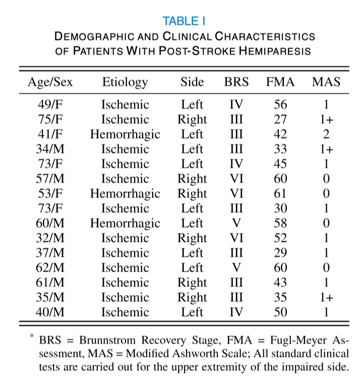

- **健康人标准：**
    - 身体健全
    - 没有神经或肌肉骨骼相关残疾的病史
    - 考虑到左右撇子对运动行为的差异，招募了8个右撇子7个左撇子
- **中国康复研究中心伦理委员会**：2017-096-1

### 实验设备及数据获取

- **实验目标：**引导多种以目标为导向的运动
- 9个**可旋转的圆柱体**（高12cm，直径6.5cm）由位于凹槽内的磁铁固定在面板上（作为抓取运动的目标）
- 实验平台固定在一张桌子上，与参与者的距离**为其最大可达范围的90%**，保证面板的中心与参与者的肩膀高度对齐

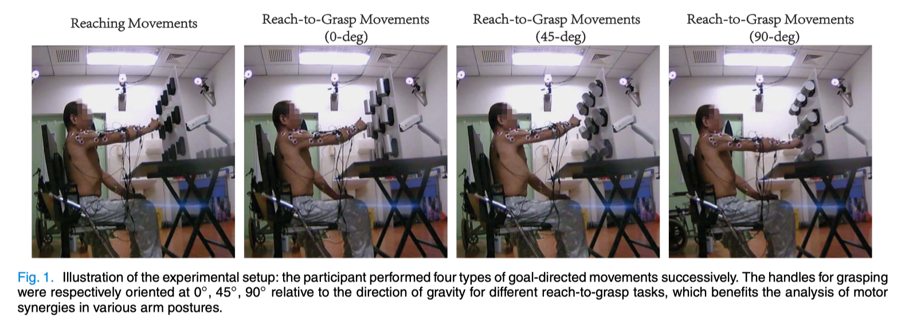

- 运动学数据由一个**光学运动追踪系统**所记录（Qualisys AB, Gothenburg, Sweden），**采样频率200Hz**，由6个高速CCD摄像机构成。
- 11个反射标记贴在参与者上肢的特定位置。

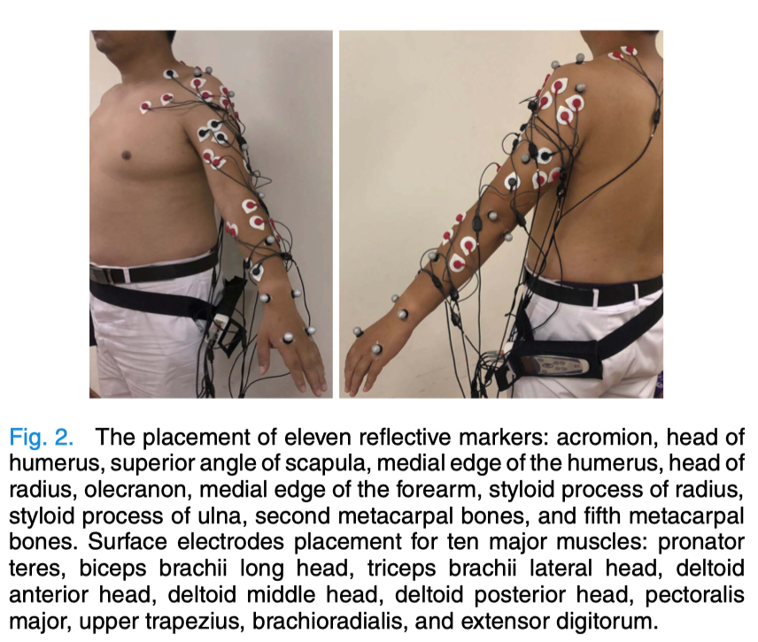

- 10通道表面肌电信号由**ME6000 Biomonitor(Mega Electronics Ltd., Kuopio, Finland)**以1000Hz的采样率获取
    - 根据人体肌肉的解刨位置，将30个表面电极连接到10个主要肌肉块。
- 上述多模态数据采集过程通过软件**Qualisys Track Manager Software (Qualisys, Sweden)**进行同步。

### Experimental Protocol

- 日常生活中大多数行为（例如喂食，刷洗等）依靠**触碰和抓握对象**来完成。
- 中风后患者很难控制这种**以目标为导向的运动**，运动障碍的严重程度取决于脑组织受损的程度。（实验过程中注意要**防止患者用躯干运动来补偿上肢运动缺陷**）
- 为了全面评估上肢运动功能，设计了4个实验任务（中风后偏瘫患者使用**患手**进行实验，健康人使用**优势手**进行实验）：
    - **1个触碰任务**：要求参与者用食指触碰目标。（每个圆盘的编号如下图所示）
    - **3个触碰抓握任务**：圆柱体的方向分别与竖直夹角为0度，45度，90度。要求参与者触碰并抓握目标。

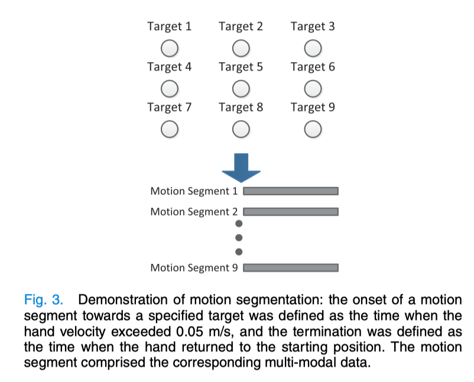

- 实验过程：
    - 初始参与者坐在椅子上，小腿与大腿成90度夹角，将**受损/优势手**放在桌子上的起始位置。
    - 每项任务中，实验者发出`go`信号后，参与者开始进行**触碰或触碰抓握任务**，到达目标后返回起始位置。
    - 当返回起始位置后，参与者**对下一个目标进行相似的运动**（总共进行9次）。
    - 完整的实验包括连续地**完成1次触碰任务和3次触碰抓握任务**。

### Data Preprocessing

#### 运动学数据Kinematic Data

人类的手臂可以被简单地分为三段**运动链（Kinematic chain）**，上肢运动模型由**7个自由度**构建，分别代表7个动作的**关节角**：

- **肩膀内外旋（shoulder internal/external rotation）**

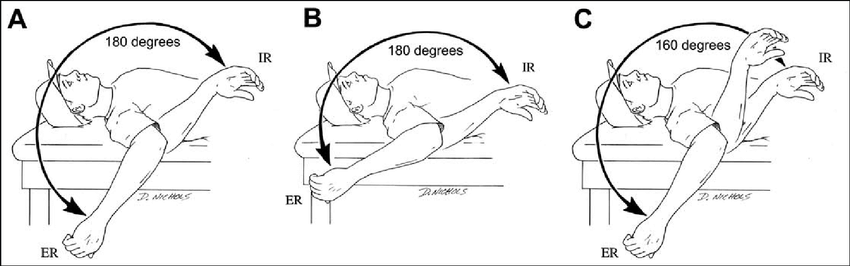

- **肩膀屈曲伸展（shoulder flexion/extension）**

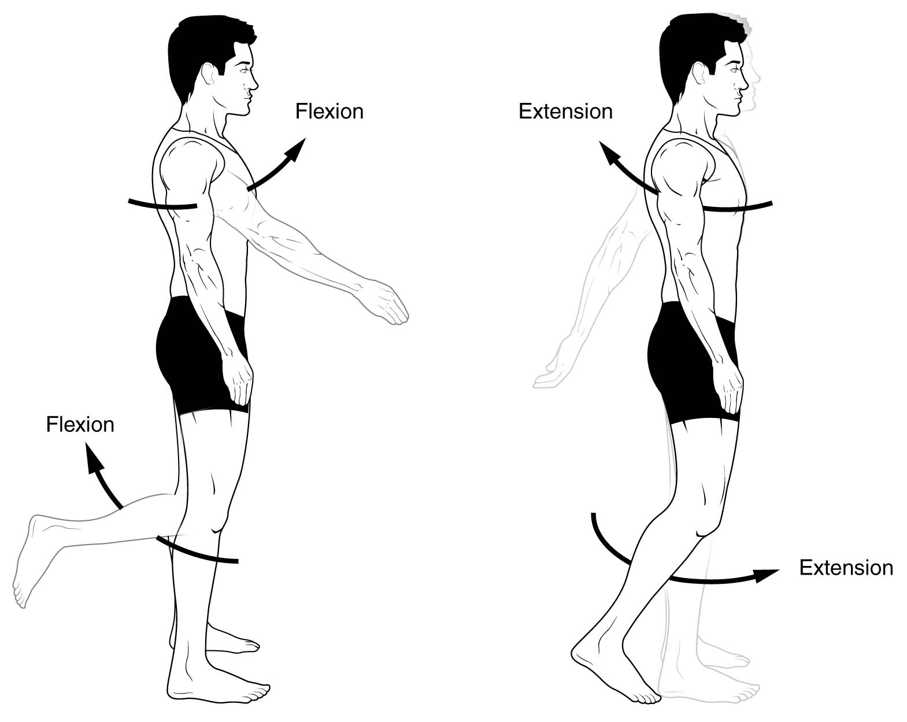

- **肩膀内收外展（shoulder adduction/abduction）**

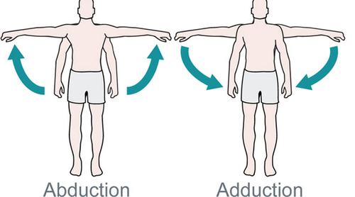

- **肘部屈曲伸展（elbow flexion/extension）**
- **手腕屈曲伸展（wrist flexion/extension）**

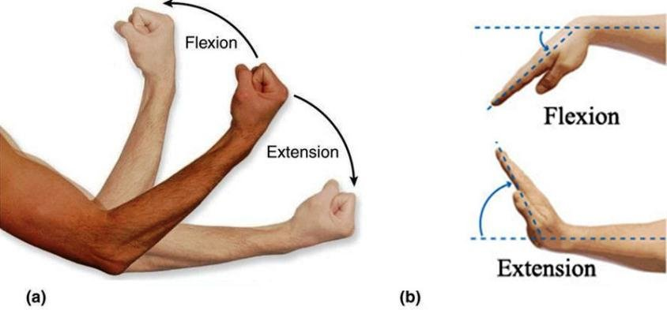

- **手腕尺偏斜（wrist radial/ulnar deviation）**
- **手腕旋后旋前（wrist supination/pronation）**

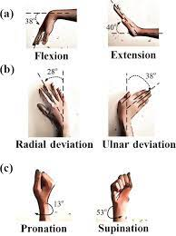

这些角度的计算，参考作者之前的论文。

Wang C, Peng L, Hou Z G, et al. Kinematic redundancy analysis during goal-directed motion for trajectory planning of an upper-limb exoskeleton robot[C]//2019 41st Annual International Conference of the IEEE Engineering in Medicine and Biology Society (EMBC). IEEE, 2019: 5251-5255.

#### 肌电数据Electrophysiological Data

电极消除了一部分常见频率噪声，再对**10-通道表面肌电信号**从20到200Hz进行带通滤波以消除**直流偏移**和**高频噪声**，最后进行**全波整流**。

当获取sEMG后，通过**在所有任务中获取的最大sEMG幅度对所有参与者的每块肌肉的sEMG进行归一化**，并将肌肉活动的采样频率与运动学数据的采样频率**进行对齐**。

计算sEMG信号可以参考下面论文：

L. Pellegrino, M. Coscia, M. Muller, C. Solaro, and M. Casadio, “Evaluating upper limb impairments in multiple sclerosis by exposure to different mechanical environments,” Sci. Rep., vol. 8, no. 1, p. 2110, Feb. 2018.

#### 运动分段Motion Segmentation

四个实验任务中：

- **实验开始：**当手上标记运动的速度超过`0.05m/s`。
- **实验结束：**当手返回起始位置。

向特定目标移动的持续时间为上述事件之间的**时间间隔**。

为了提供更加准确的上肢运动障碍信息，每个实验任务将预处理的**运动学**和**sEMG数据**分为**9个部分**，因此每个参与者是`4*9=36`个运动段。

## Multi-Modality Fusion Framework for Functional Assessment

### 提取运动学统计特征Extraction of Statistical Motor Features

大多数中风幸存者对肢体移动（例如伸手）的控制有缺陷并伴有**痉挛**，因此**从运动学和肌肉水平提取的运动特征可用于表征运动障碍**。

大量研究表明，健康人在不受约束的情况下执行**点对点（point-to-point）移动**符合最小加速度的原则（最大化运动的流程程度）。

从$(x_i,y_i,z_i)$到$(x_d,y_d,z_d)$的最小加速度轨迹可以由如下式子表达：
$$
x(t) = x_i + (x_d-x_i)(10\tau^3-15\tau^4+6\tau^5)\\
y(t) = y_i + (y_d-y_i)(10\tau^3-15\tau^4+6\tau^5)\\
z(t) = z_i + (z_d-z_i)(10\tau^3-15\tau^4+6\tau^5)
$$
其中，$\tau=t/t_d$，$t_d$是移动的总时间。

两个标准的**最小加速度轨迹运动段**：

- 从起点到目标点
- 从目标点到起点

计算一个运动段中每个方向的手腕运动实际轨迹$X_a$与标准轨迹$X_s$的时间偏差：
$$
\tilde{X}=X_a-X_s
$$
其中，$X=[x,y,z]^T$是三维笛卡尔坐标系。

统计分析利用了均值$MV$和标准差$SD$：
$$
MV_d=\frac{1}{N}\sum^N_{k=1}\tilde{X_k}\\
SD_d=\sqrt{\frac{1}{N-1}\sum^N_{k=1}(\tilde{X_k}-MV_d)^2}
$$
为了描述**肘关节、腕关节和手**的摆动幅度，使用了差值绝对平均值$DAMV$：
$$
DAMV=\frac{1}{N-1}\sum^N_{k=2}|X_k-X_{k-1}|
$$
对于肌肉水平，为了评估负责姿势控制的肌肉活动情况，使用了平均绝对值$MAV$：
$$
MAV = \frac{1}{N}\sum^N_{i=1}|u_i|
$$

### 量化上肢协同作用Quantification of Upper-Limb Synergies

根据每个运动段的角度**计算相关矩阵**，并通过PCA来求得**特征向量和特征值**，将七个自由度转换为一组不相关的线性组合。

通过特征向量之间的角度相似性来**比较PC集跨越的子空间**，差异性根据**kWAS算法**：
$$
\psi(S_p,S_h) = 1 - \frac{1}{2}\sum^n_{i=1}\left[\left(\frac{\sigma_i}{\sum^n_{j=1}\sigma_j}+\frac{\lambda_i}{\sum^n_{j=1}\lambda_j}\right)|u_i\cdot v_i|\right]
$$
其中，$\sigma_i$和$\lambda_i$分别对应于两个不同相关矩阵的特征向量$u_i$和$v_i$的特征值，$n$为自由度。

对于评估关节协调的改变程度，$S_p$和$S_h$分别代表每个参与者与健康对照组中提取的**运动$\psi_k$和肌肉$\psi_m$协同作用**。

$\psi$的范围在$[0,1]$之间，中风受损越严重，$\psi$​的值越大，可以用于运动功能的评估。

### 单模态分类器Single-Modality Classifier

在**统计特征提取**及**运动协同量化**后，创建两种不同的**单模态分类器**（**局部分类器**和**集成分类器**），并根据每个模态数据得出的特征来评估上肢运动功能。

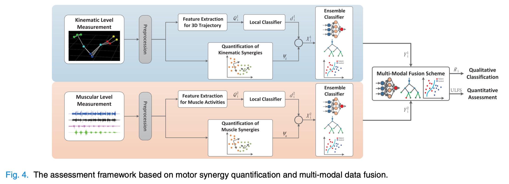

本文选取三种不同的监督学习算法作为单模态分类器的候选：

- SVM（核：RBF径向基函数）
- BPNN（sigmoid，梯度下降算法）
- RF（集成学习，分类结果由决策树的多数票决定）

实验样本：在一个运动段中同步采集的**多模态数据**，并根据参与者的组别设置标签（病理组`+1`，健康组`-1`）

对于**局部单模态分类器**，输入向量$Q^m_i$为从第$i$个运动段中提取的第$m$个模态，定义为：
$$
Q^m_i=\left[v^m_1,...,v^m_n,...,v^m_{N^m_l}\right]
$$
其中，$v^m_n$​为第$n$​个统计运动特征，$N^m_l$是总的被选择特征数。

$Q_i^1$​​和$Q_i^2$​​分别代表**运动学**和**表面肌电**的分类器。

将不同模态的特征向量导入各自的分类器，得到第$m$个模态的输出向量：
$$
d^m_i=f^m_{local}(Q^m_i)
$$
其中，$f^m_{local}$表示3个**监督学习算法**，$d^m_i$​​表示预测**属于病理组的可能性**。

之后，**将局部单模态分类器的输出与上肢协同作用的评估结果**相结合，构建**集成单模态分类器**的输入向量：
$$
X^m_i=\left[\eta^m_1,...,\eta^m_n,...,\eta^m_{N^m_e}\right]
$$
其中，$X^m_i$​表示第$i$​个运动段中提取的特征向量，之后输入给第$m$​个**集成单模态分类器**。$\eta^m_n$​​表示**局部决策和共激活特征的组合**。

三种监督算法可以统一表示为：
$$
Y^m_i=f^m_{ensemble}(X^m_i)
$$
其中，$Y^M_i$表示第$i$个运动段的预测可能性向量。

### 多模态混合方案Multi-Modal Fusion Scheme

为了**全面分析**中风后偏瘫患者的上肢运动功能，将所选**集成分类器的输出连接在一起形成融合模型的输入向量**：
$$
R_i=G_{fusion}(Y^1_i,...,Y^m_i,...,Y^M_i)
$$
其中，$R_i$是第$i$个运动段的最终预测可能性。$G_{fusion}$混合算法。

混合36个参与者的预测概率，构成一个定量评估分数，称为**上肢功能评分（ULFS）**。

## Results

### 定性分类的表现Performance of Qualitative Classification

**ROC曲线（Receiver Operating Characteristic Curve），受试者工作特征曲线**

- **横坐标为假阳性率（False Positive Rate, FPR）**，$FPR=\frac{FP}{N}$，N是真实负样本的个数，FP是N个负样本中被分类器预测为正样本的个数。
- **纵坐标为真阳性率（True Positive Rate, TPR）**，$TPR=\frac{TP}{P}$，P是真实正样本的个数，TP是P个正样本中被分类器预测为正样本的个数。

**FPR越低越好，TPR越高越好。**

**AUC面积（Area under roc Curve）**，ROC曲线下的面积大小，AUC越大，模型性能越好。

**运动学单模态分类器：**

- 最优局部分类器：SVM
- 最优集成分类器：SVM

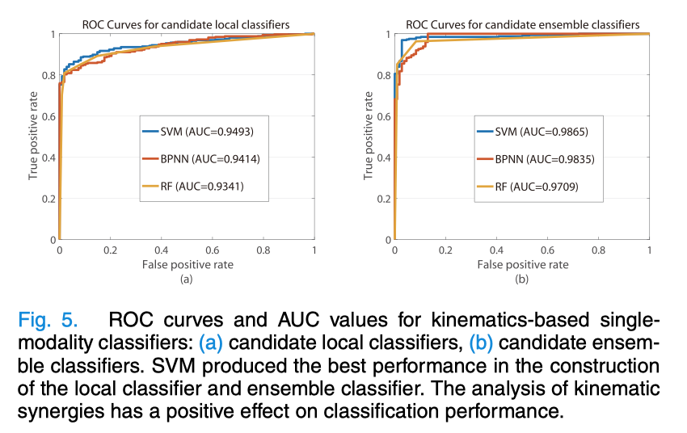

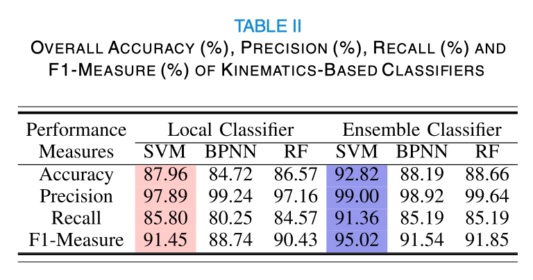

**sEMG单模态分类器：**

- 最优局部分类器：SVM
- 最优集成分类器：BPNN

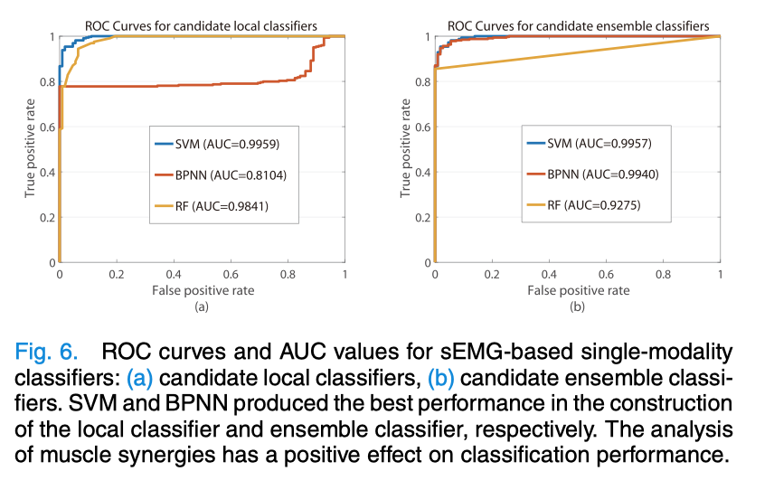

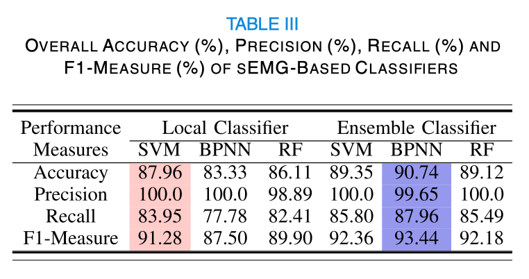

**多模态分类器最优：**SVM

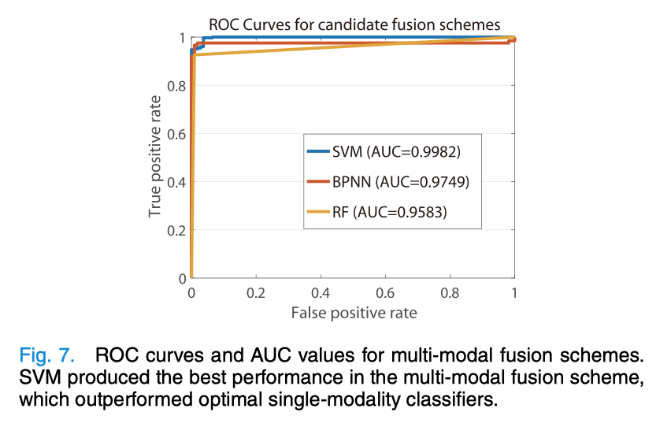

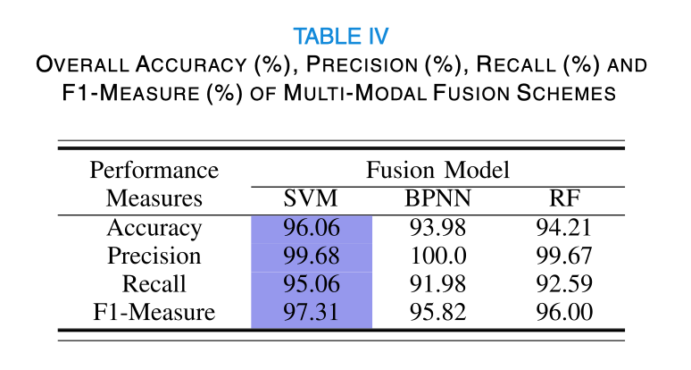

**结论：**通过整合**多模态特征**可靠地识别中风后偏瘫患者的上肢运动障碍**（96.06%）**。

### 定量评估的表现Performance of Quantitative Assessment

定量评估运动学与肌肉协同性分析主要由参与者的$\psi_k$和$\psi_w$​呈现。

- 圆圈/蓝线（平均值）/蓝色区域（标准差）：患者组
- 三角形/红线（平均值）/红色区域（标准差）：健康组

定量结果**值越小说明运动功能越好**。

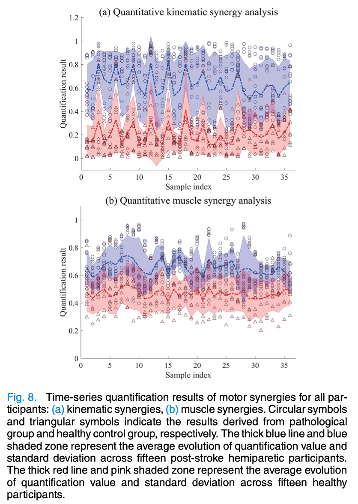

为了进一步验证定量评估方法，将

- 基于运动学的最优集成分类器（OKEC）
- 基于sEMG的最优集成分类器（OSEC）
- 最优多模态分类器（OFC）

与传统的评估方式**（Fugl-Meyer Assessment Upper Extremity（FMA-UE））**进行对比。

**Pearson相关检验（显著性水平0.05）**

- OKEC：$R=-0.72$，$P=2.60e-3$
- OSEC：$R=-0.69$​​，$P=4.10e-3$​​
- OFC：$R=-0.87$​，$P=1.98e-5$​

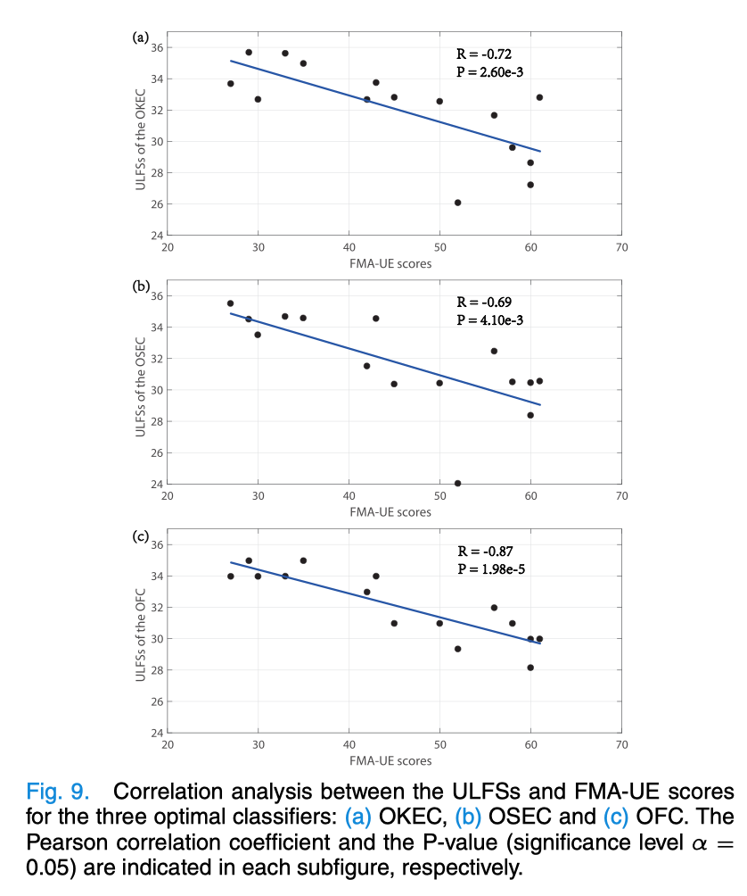

**结论：**结合运动协同分析有助于定量评估用户行为，**多模态混合方案**有助于提高相关性并生成一个更全面的评估结果，用于监测运动功能康复的过程以及现有治疗方案的有效性。

## Conclusion

**目标：**研发一个**定性分类**和**定量评估**的中风后偏瘫上肢运动功能自动评估系统。

- 基于具有挑战性且以目标为导向的移动中采集**运动学和sEMG数据**实现。

**贡献：**运动协同定量评估基于**运动学和肌肉水平**上进行，提供对可观察到的运动缺陷的共激活特征的深入分析。

- **多模态混合方案**在定量评估过程中是效果最好的（准确率$96.06\%$，Person显著性$R=-0.87$，$P=1.98e-5$）。

本文结果表明，提出的评估系统可以**为医疗决策提供有价值的信息**，**评估中风后上肢偏瘫的患者治疗方案的有效性**。未来的研究将**根据评估结果探索康复策略的制定**，以进一步验证评估体系。

