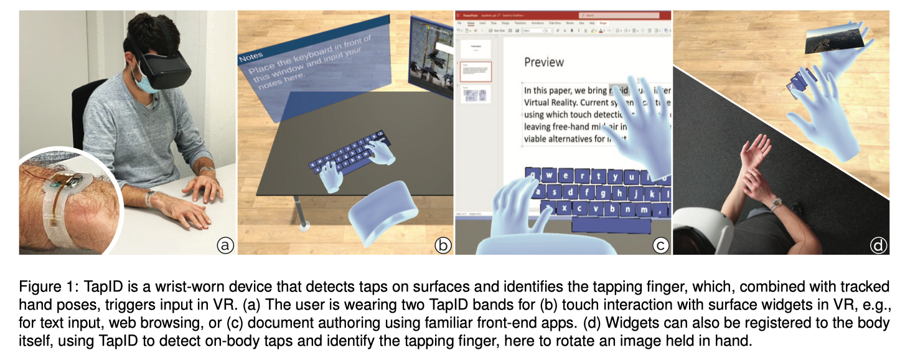

# Abstract

当前虚拟现实系统主要使用摄像机捕获控制器或手势交互来判断用户的输入。

本文作者认为这是VR作为生产力场景的一个关键障碍，因为这是一项长时间的持续互动，而控制器或手势交互的输入无法满足这一需求。

为了解决这个问题，作者开发了VR场景下的表面快速点触交互TapID，一种基于手腕惯性传感系统，与头戴式跟踪的手部姿势互补，来触发VR中的输入，这是一项用户已经连续在手机或平板上习惯的输入方式。

TapID在柔性带子上嵌入了一对惯性传感器，两手各一只，从预设的信号组合中，TapID可靠地检测表面点触时间，同时识别用于点触的手指。

作者进行了一系列用户实验来评估TapID，事件监测准确率（F1=0.997）。

作者经过一系列的应用验证TapID，包括UI控制，快速键盘输入，钢琴弹奏和表面手势。

# Introduction

- 最新的混合现实系统将手势识别用于输入检测，用于增强现实（例如HoloLens 2）和虚拟现实（例如Quest 2）。之前的几代设备很大程度上依赖于手持控制器进行输入，但无论是在研究领域还是在商业领域，都趋向于无控制器、手部姿势为导向的输入方式。
- 增强现实中，手部追踪非常适合与物理对象交互的工作，例如维护、修理、制造或装配。在物理对象上工作，用户可以抓住某些东西，从而减轻在使用过程中的疲劳。
- 本文，作者提出了一种基于参考面的VR全向移动交互，对比于空中交互，参考面上的点触交互可以让用户有机会在互动之间放松他们的手臂，在长时间的交互中提供身体的支撑。同时，在参考面上交互提供了触觉反馈与本体感知，可以提供快速和精确的交互。
- VR系统中点触交互的挑战是准确监测点触事件，由于手由头显系统本身来追踪，单目视角会导致深度检测方面的误差，从而不能很好地识别点触与非点触的触点定位。
- 作者通过佩戴在用户手腕上的TapID绑带来解决快速可靠点触检测的难题，在其内建一个惯性传感器，TapID不需要监测参考面上点触事件，而是去识别点触时的手指使用情况。从而将原本在平板和手机上与应用程序的交互模式无缝可靠地转移到VR场景中。
- 下图展示了作者的方法，用户在VR中通过徒手进行交互，TapID提供了手指在参考面上手指弯曲及点触的跟踪信号，并将惯性事件传输到PC。同时，VR头显也用内置算法来获取佩戴者手部姿势的图像辅助识别。
    - 当TapID通过惯性传感器检测到点触事件时，系统会将输入事件转发给VR应用程序，同时验证用户的手是否靠近参考面，如果靠近参考面，则程序会在相应的手指位置触发一个输入事件，否则，将其作为一个雾效输入。
    - b：快速可靠的输入检测。c：PPT上进行操作。d：将用户肢体作为参考面来进行输入。

- 下图说明了TapID的传感原理。在弹性硅胶表带中嵌入Soc平台，同时连接手腕两侧的两个加速度计，加速度计通过腕带与佩戴者的腕关节贴合，从而接收移动信号。

- 下图展示了弯曲不同手指左右加速度计数值的变化（5个手指分别点触30次进行采样），通过机器学习的方法来检测点触和识别点触手指。

- 本文三个主要贡献：
    - 引入了一种基于手腕传感方式来检测参考面点触事件，并通过集成到表带中的双加速度计配置来识别引起点触的手指。
    - 演示了TapID的原型系统，使用机器学习来实时处理和分类输入事件，之后将输入事件转发到VR系统中，同时与头显的手势识别相结合，来触发VR的输入。
    - 对18名参与者进行实验评估，评估TapID在检测点触事件与手指识别方面的性能。

# TapID Wearable Device and Electronics

- 下图展示了TapID的组成结构，它内部是一个芯片（DA14695），以1344Hz的频率对所有惯性传感器进行采样，通过串行连接将IMU数据流传输到PC。
- TapID有两个低功耗加速度计（LIS2DH），通过柔性PCB嵌入到腕带中，以及两个板载加速度计用于测试和比较不同的传感器配置。
- 作者使用Shore-32硅胶制作了TapID表带，并在其中嵌入了所有的电子器件。

# Tap Event Processing Popeline

- 作者的系统检测和呈现所有的点触事件通过一个时间戳，识别造成点触的手指，世界坐标系中参考面的2D坐标。
- 下图展示了点触事件发生的信号处理过程，机器学习模型，结合了手部跟踪的VR头显。

## Tap event detection & timestamp calculation

- 为了区分点触与其他手臂手部移动，作者通过加速度计信号中产生的波峰来选择事件。
- TapID不是设置简单的幅度阈值，而是累加所有加速度计和轴的原始信号（RS）的变化率，来计算变化率得分（RCS）。计算公式如下：

- 在20个样本（15ms）的窗口中，获取点触事件的确切时间戳，即RCS峰值。每个点触事件处理后，在检测新的事件之前会有一个200ms的空窗期，这可以方式单次点触的多次预测，在使用双手时允许每分钟600次点触事件。

## Tap event finger identification

- 当检测到一个点触事件时，系统会返回TapID的时间戳和各加速度计值到网络模型中来识别手指ID。
- 网络模型实现为一个多层前馈1D卷积神经网络，遵循VGG风格的架构。
- 作者介绍了大量的网络模型及预处理方式设计的原则，完整的分类网络包括210多万个可训练参数，在Pytorch中实现了模型，Adam优化器，$10^{-4}$学习率，$\epsilon=10^{-8}$，$\beta=(0.9,0.999)$，30个epoch。

## Combining hand tracking with TapID events

- 在确定了哪根手指点触后，作者在用头显跟踪的手中索引指尖位置，并指向在TapID的点触事件中。如果在VR中，被检测到的指尖不在一个表面附近，则系统就定义该点触事件为无效输入。
- 经过作者实验，30mm是一个可靠地检测和拒绝的最大表面距离，VR中点触事件的参考面也可以用自己的肢体，当UI元素固定在用户手臂上时，系统可以检测在身体上的点触输入。
- 整个系统由Unity3D引擎来进行渲染，并使用Velt来对数据进行整流。
- Oculus Quest头显渲染VR应用，同时用它的SDK来对头显位置和手部姿势进行追踪。
- 虽然在实验中作者发现用头显来直接追踪用户指尖位置是可行的，但是它无法在参考面上检测实际可靠的点触。

## Pipeline latency

- 作者通过实验发现，从物理点触到在Unity中显示其效果的总延迟为130ms，包括所有硬件操作、通信、处理和输出的所有延迟。
- 作者根据经验确定TapID的传感、机载处理和通信管道的平均延迟为10ms，基于机器学习的分类包括对每个点触事件的缓冲数据采集延迟为50-60ms，具体如下：
    - 传感器数据输入输出：3ms（最大6ms）
    - SoC处理和串行传输到PC：3ms
    - 点触事件激活：15ms
    - 数据窗口完成缓冲：47ms
    - 神经网络接口耗时：2ms（GTX 1050Ti）

# Technical Evaluation

- 技术评估的目的是验证传感原理与信号处理方法，检测手指点触事件和识别手指。同时确定手腕不同安装位置和组合的加速度计在多大程度上有助于准确率的提升。
- 为了这个目的，作者比较了如下图3种不同情况的分类结果F1值，同时也记录使用所有四个传感器的F1值。之后建立一个数据集，用于训练之后VR应用的点触事件。
- 作者进行了两项实验，实验的任务的过程相同，但是由不同的参与者进行：
    - 第一项评估点触事件检测的准确性
    - 第二项评估手指识别网络模型的准确性

## Task

- 参与者静坐在一张桌子旁的办公椅上，手臂放在桌子边缘，参与者用指定的手指反复点触桌面。
- 此外没有提供其他指示，参与者控制自己的点触频率、强度、位置、手指和手的动作。

## Procedure

- 实验开始前会对TapID进行简短的介绍，实验者将其与一块普通的智能手表联系起来。
- 之后实验者记录参与者的年龄及性别，并测量他们手腕长度，整个实验过程中，实验者指导参与者在每次实验期间在哪只手臂上佩戴腕带，用哪只手点触。
- 每一轮，参与者将TapID设备放在指定的手腕上，每根手指按指示重复30次，总共$30次*5根手指*2只手=300$次，每名参与者执行3轮，各轮之间有休息，一共900次点触，在20min内完成。

## Participants

- 18名（14男4女，年龄19-57，均值28.4），平均手腕周长168mm（SD=10mm，min=146mm，max=185mm）
- 18名参与者中4名（3男1女，年龄23-29，均值25.3）额外参与了点触检测的性能评估，平均手腕周长158-176mm。

## Evaluating tap event detection

- 为了记录是否进行表面点触事件，作者使用一个被盖住并粘在桌面上的听诊器来记录回声。
- 评估过程中，参与者保持安静，以避免在记录的信号中引入人为干扰。
- 这次评估中一共有3600个点触事件，作者的得到TapID的F1值为0.996（准确率：99.7%，召回率99.5%），FITBIT与SMARTWATCH的F1值同样为0.996。

## Evaluating tap event identification

- 在该评估中，用哪根手指进行点触事件来自实验者的指示，实验者将该指示记录，以便后续打标签。

### Results in TapID configuration

- 作者计算所有参与者的每根手指的F1值均值，标准差，并对不同等级的F1值采用非加权的均值来使得各手指视为同等重要。
- **Cross-session identification accuracy**：每个参与者进行3折交叉验证，两个组进行训练，一个组进行测试，忽略其他参与者的数据。所有参与者的F1值均值为0.93（SD=0.06）
- **Cross-person identification accuracy：**进行18折交叉验证，对每个参与者进行训练和测试，F1值为0.87（SD=0.09）
- **Cross-person identification accuracy with refinement:** 数据集的大小对不同参与者的结果影响。

## Discussion

- 实验结果验证了传感原理和在手腕上实现点触事件的有效性，这也验证TapID原型系统，在硅胶带里嵌入了两个低功耗的IMU。
- 在点触事件的检测方面，TapID的实现精度足够实用，在FITBIT和SMARTWATCH中精度也同样足够。
- 在点触事件分类方面，在多次点触、多人验证后训练数据结果会更好，F1值最高为0.96。

- 调查结果显示，个人的手腕周长也会影响分类的准确性，其原因可能是惯性传感器之间的距离一直没有调整。

# Use Case

- 在很多VR场景中，TapID可以用于补充高质量的输入，这里作者提到其他更广泛的应用场景。

## Scenarios

- 典型的VR场景，用户与虚拟对象进行交互，这些对象缺乏现有物体的支撑，因此需要通过手持控制器或空中手势进行交互。然而，空中手势交互在长期没有物体支撑的情况下缺乏休息很容易产生疲劳。
- VR应用迄今为止的主要成功是在场景中融入了用户肢体，很多当前虚拟办公环境的生产力应用只关注内容消费而不是内容创造，不充分的交互方式（空中输入），大多只能使用手持控制器来进行输入，其无法作为长期的生产力。
- 如果输入方式不有效、不准确、高疲劳，则很难开发具有沉浸式的VR生产力的应用，很多具有生产力的工作特点是具有持续的交互作用，通常以流动和快速输入的双手操作形式出现，并且常常涉及完成任务的工具。

- 除了基于生产力的场景，TapID也可以在更有趣的用例中发挥作用，例如钢琴游戏等。

## Application Prototypes

- 作者实现了一些应用原型，来展示通过TapID在VR中快速点触交互。这些场景中，用户处于虚拟现实环境中，周围是典型的桌面和用户界面内容，例如照片收集和网络浏览器。
- 为了方便与用户界面的交互，作者开发了一系列基于点触的虚拟输入设备，用户可以通过特定的手指点触表面上想要的位置来打开和定位，例如：左手小指可以召唤方向键、右手小指可以触发数字键盘、拇指可以触发简单键盘。
- 下图是四个场景的UI界面：

# Limitations

- 当前无法识别多点触摸事件，目前尽管可以实现双手输入，但是只能检测单个手指。
- 当前仅在作者的办公桌以及自己手臂上进行了实验，没有对不同材质的桌面进行验证分析。
- 没有对点触的力度进行分析。
- 在固定的坐着的环境下测试和评估了系统，没有在身体运动过程中测试。
- 当前还依赖于头显的定位，因此点触的位置必须在头显检测范围内，否则传感器的点触事件为无效输入。因此用户需要在VR中查看与之交互的内容，包括在显示的键盘上输入文本，闭目无法操作。
- 是否在智能手表上应用（戴两个智能手表不现实），未来用户或许可以在VR交互时戴上两个小腕带，同时当前分类需要一块不错的GPU，因此可能不适合嵌入式处理。

# Conclusions

- 本文开发了TapID，一款可穿戴传感设备，与基于摄像头的手部跟踪一起，为VR系统带来快速的点触交互。
- 本设备为持续使用期间的可靠和长期交互奠定基础，用户可以将手臂和手部放在一个参考面上，对于每一次点触，TapID都会可靠地检测到点触事件，并识别是哪根手指。
- 对18名参与者进行实验，验证了结果的有效性，针对不同人员数据进行训练的分类器进行交叉验证，结果准确率会下降，然而，通过少量用户点触事件进行细化训练，准确率可以得到一定的提升。
- 本文是对现有VR系统的一个可行补充，允许熟悉的点触输入模式转移到空间VR系统中，甚至可能在日常场景中。这一方面，一个比较有前景的是FITBIT配置中评估作者的方法，仅使用TapID的板载IMU传感器，就像现有的可穿戴设备中，作者也评估了其有不错的精度。

