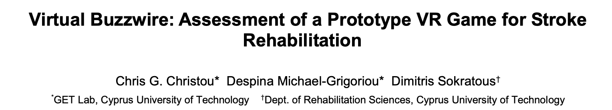
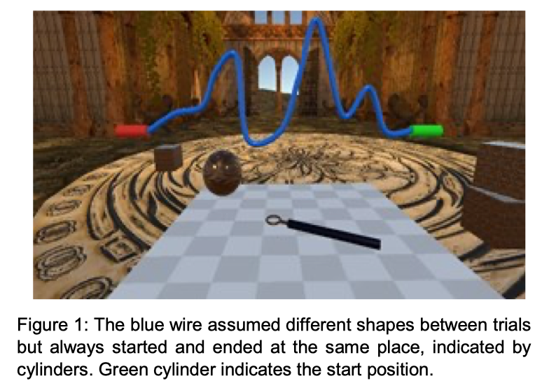
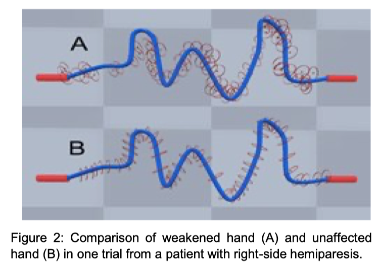

# Abstract

我们开发一个基于VR版本的**Buzzwire儿童玩具**，作为评估及康复脑卒中患者上肢运动灵巧性的工具。

在两项实验中，佩戴头显的参与者使用**具有精确跟踪功能的手持魔杖**穿越虚拟“电线”。

- 第一项实验：比较身体健全的参与者在**使用及不使用**双目视觉的情况下的表现，以建立与现实版本游戏之间的联系。同时，表明本文的扩展措施可以辨别受试者的**优势手与非优势手之间的差异**。
- 第二项实验：对一群小样本脑卒中偏瘫患者进行了**系统的可用性评估**，他们觉得**该游戏场景不会产生疲劳或恶心感**，测量结果显示患手与健手之间的差异。

# Introduction

- 大脑损伤后，对**眼手协调的精细运动**的恢复是一个**漫长而艰巨的过程**（需涉及大量简单重复的移动训练）。
- 患者需要定期去诊所接收训练治疗（依从性低），**对医疗系统造成沉重的负担**。
- **疲劳、缺少动力和肌肉骨骼受伤等因素**阻碍人们开始或维持治疗计划。
- 随着VR技术的发展，可以使运动康复更具有**娱乐性**、**居家便利性**、**治疗的精准测量与评估性**。
- 本文开发了一种**基于眼手协调的VR评估系统**，并验证VR技术是否可以改善康复过程。

VR游戏基于一项著名的儿童玩具（**线环游戏Buzzwire**），该游戏的现实版本已经得到了诸多实验研究。

>Budini等人用**线环游戏**评估短期灵活性训练对肌肉震颤的影响。
>
>Read等人用**线环游戏**研究精细运动技能的双眼优势。

之前所有的研究都利用**线环游戏**中**【线与环的触碰次数】**、**【通关时间】**来作为研究变量，这些因素在VR环境下也可以作为参考（准确地跟踪用户的3维运动，采用**环路方向**、**环线间距**、**平均移速**作为评价指标）。

本文进行了两项实验来证明VR游戏的可行性：

- 第一个实验验证**先前线环游戏的研究结果在VR环境下是否可以得到复制及扩展**。
- 第二个实验评估**VR版本的线环游戏对脑卒中患者是否具有可用性**。

# Experiment 1

第一个实验探究了**双目立体视觉**在现实及虚拟游戏之间建立联系的优势，同时测试是否可以使用现实游戏中不易获取的其他因变量来**衡量惯用手与非惯用手的影响**。

本文设计评估了**用户在5种不同形状的电线上进行操作的能力**，通过让用户用**惯用手和非惯用手**穿过每根电线来比较两者之间控制的差距，**每根电线的呈现和左右手使用的顺序是随机的**。

- 实验的第一部分，参与者使用**双目视觉**执行任务。
- 实验的第二部分，参与者的**非优势眼的屏幕被关闭**，仅用单眼显示。

双眼和单眼测试都使用相同的一组电线（按随机顺序），因变量为：**完成每根线的时间**、**环与线之间的碰撞次数**、**环与线中心的平均偏差**、**起点到终点的总距离及平均速度**。

用户根据线的**端点颜色**（绿色起点，红色终点）被告知从哪个方向开始实验。

18个身体健全的参与者（9男9女，平均年龄33.2，中位数34）进行了实验，每个人实验前通过Edinburgh Handedness Questionnaire来判断他们的惯用手。

**Unity 3D**引擎用于创建具有**照明**、**粒子系统（环与线碰撞时产生的火花）**、**碰撞时音频**等模拟，**SteamVR SDK**用于**处理场景显示**、**传感器数据跟踪**、**HTC Vive跟踪器用户交互**，**5条线**通过三次Hermite插值生成。

# Results 1

- 针对**偏离线距离**的结果表明，**最佳性能**是使用**惯用手与双目立体视觉**（平均值0.4cm，标准差0.02cm）；
- **最快时间**也是使用**惯用手与双目立体视觉**（平均值18.4秒，标准差1.35秒）；

上述结果表明玩VR版本的线环游戏最佳模式是使用**惯用手与双目立体视觉**。

对**所用时间**、**线与环的碰撞次数**、**环与线的偏离值**、**穿过线的总距离**、**平均速度**进行方差分析，得出有三个主要因素：

- **STEREO：**双目与单眼
- **HAND：**惯用手与非惯用手
- **WIRE：**5个级别的线路

结果表明，**双目视觉在所有测量中都显著好于单眼**，**惯用手在总时间、平均偏差和平均速度明显优于非惯用手**。

因此本文认为，**如果提供给用户双目视觉，VR版本的游戏可以对精细运动的手眼协调提供一个有用的评价**。

之后会对有运动功能受损的参与者进行实验，评估这些方法是否在使用上是可行的，以及验证它是否可被用作一种娱乐形式的康复训练，并判断运动能力是否随时间而改善。

# Experiment 2

第二个实验在**康复诊所**中进行，除了仅使用双目视觉外，其余实验内容相同。

参与者为6名偏瘫患者（4名右脑缺血性中风，2名左脑缺血性中风，平均年龄55.5岁，中位数56岁）。

# Results 2

实验表明，由于**脑卒中患者的偏瘫手臂和手部运动缺乏旋转**（旋前和旋后），导致环与线之间经常碰撞。

从下面图中可以很容易看出（**A是患手，B是健手**），由于无法旋转，患者在改变环的方向时比较困难。

实验中发现，**患手的平均速度更快**，这可能是因为**参与者的患手没有完全遵循曲线**，这一点可以从碰撞次数增加看出。

实验结束后以问卷的方式评估**系统的可用性**，结果表明，使用头显没有产生太多的不适感，也没有出现恶心感，但是一些患者说**使用头显难以专注于现场**。

# Conclusion

- 实验一表明，使用VR版的线环游戏可以获取现实游戏中不易获取的有用数据，同时验证了与现实版游戏一致，使用双目视觉对于精确的手眼协调是非常理想的，此外还证明了惯用手对该游戏的影响。
- 实验二表明，该系统对患者具有一定的可行性，在舒适感和易用性方面，患者容易适应该系统。

之后会进一步验证对照组的长期监测，以确定VR是否可以成为更好的脑卒中康复替代方案。